# 1.2	NC Cloud开发环境搭建
 ## 1.2.1	前端环境
  ### 1.2.1.1	前端脚手架
  前端脚手架地址：http://git.yonyou.com/nc-pub/ncpub-multipage-demo，如下图：
  
  在eclipse或者vscode或者其他开发工具中下载到本地目录，如下图：
  
  这是前端环境的脚手架，前端项目需要放在src目录下运行。
 
  ### 1.2.1.2	前端项目
  前端项目地址：http://20.12.4.52:7070/gerrit/#/admin/projects/，如下图：
  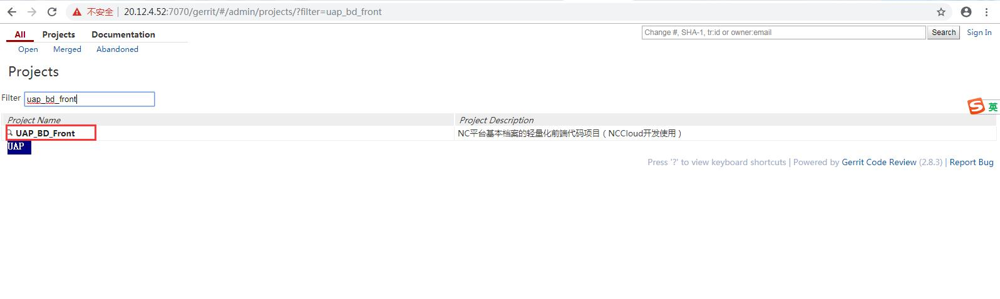
  域账号登录后使用SSH下载UAP_BD_FRONT基础数据前端项目到脚手架的src目录下，并更名为uapbd，如下图：
  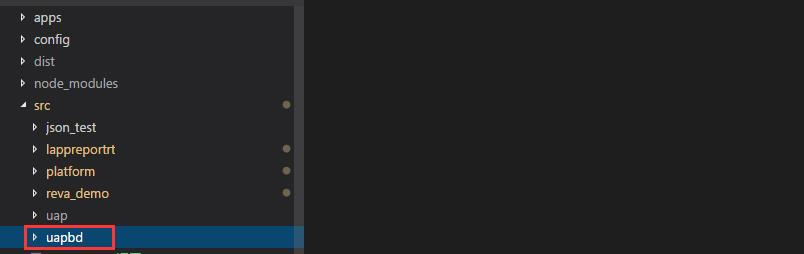
  
  ### 1.2.1.3	前端工程初始化
  用前端开发工具（这里使用vscode为例）打开脚手架，如下图：
  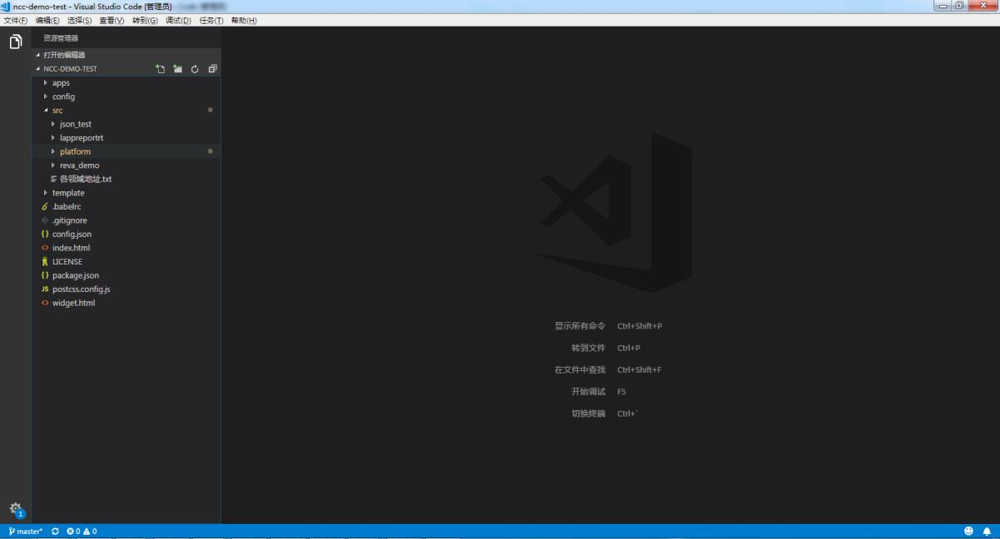
  使用【Ctrl+`】打开终端，输入命令
  切换淘宝镜像：npm config set registry https://registry.npm.taobao.org
  下载依赖: cnpm install，下载完成后目录中会出现node_modules文件目录，如下图:
  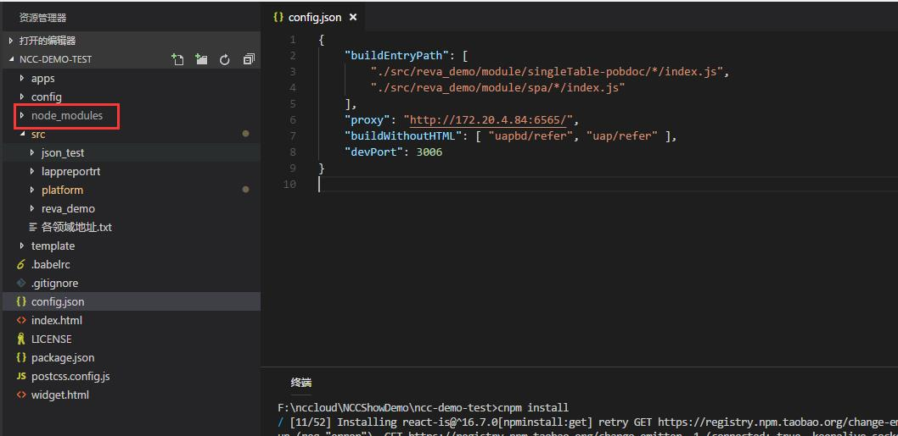
  
  ### 1.2.1.4	修改config.json配置文件
  在config.json中有几个配置需要修改，如下图：
  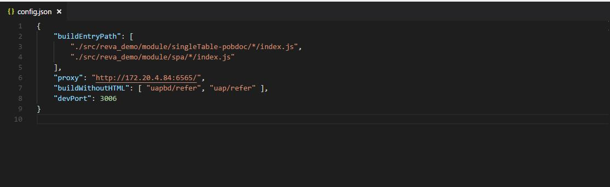
  buildEntryPath：配置启动时需要编译的路径，以./src/uapbd开头
  proxy:配置代理IP和端口，如下图:
  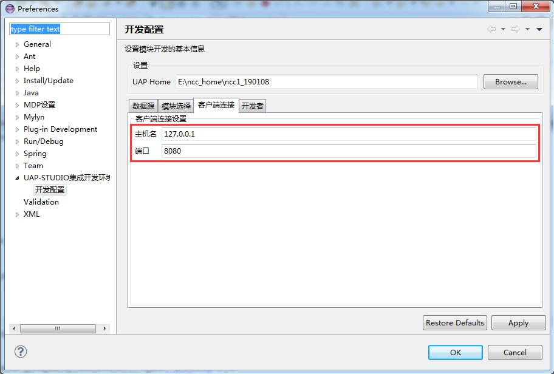
  
 ## 1.2.2	后端环境
  ### 1.2.2.1	后端模块
  后端模块下载地址：http://20.12.4.52:7070/gerrit/#/admin/projects/
  域账号登录后使用SSH 在eclipse中分别下载ria_riamm， ria_riaorg0，ria_uapbd，ria_riaorg，ria_uapbd0，到本地git仓库，如下图：
  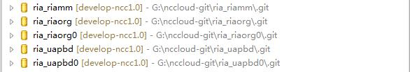
  如需要下载其他领域的模块，git地址：
  http://172.16.50.81/pages/viewpage.action?pageId=31787451，如下图：
  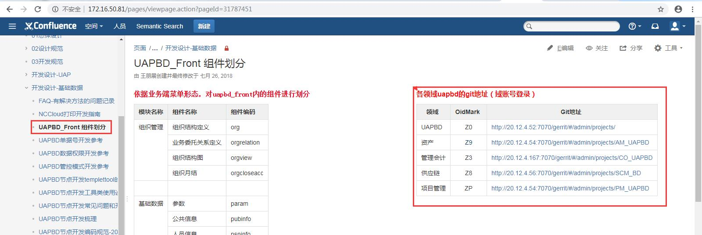
  同样的方式下载到本地仓库。并且使用Import Projects 导入工程。
  由于uapbd所有模块都依赖ria_riamm模块，所以其他模块都需要引入ria_riamm，如果有对其他模块的依赖，也需要依次引入，如下图：
  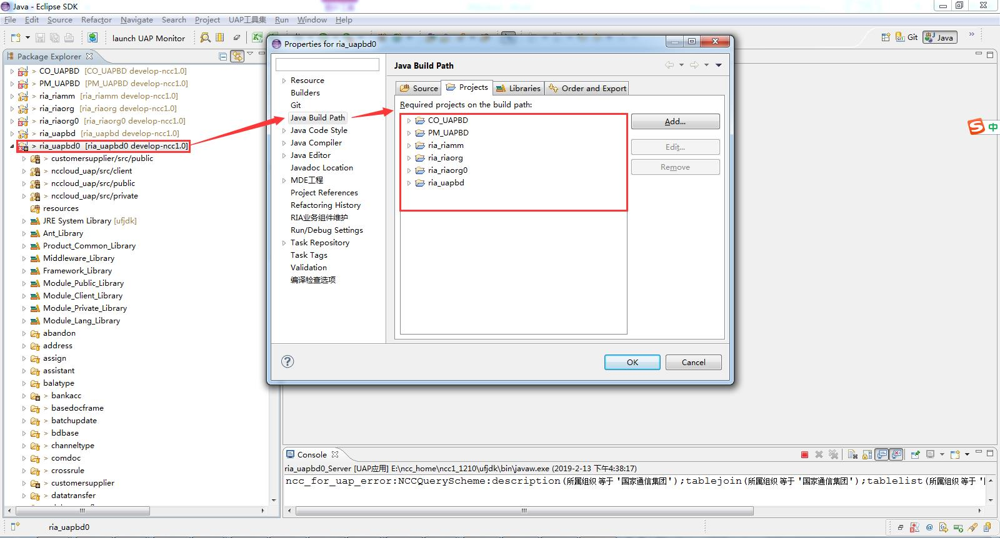
  这里启动的是ria_uapbd0，所以为ria_uapbd0模块配置启动参数，如下图：
  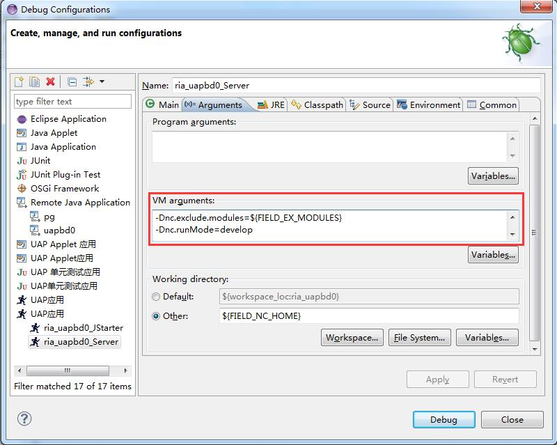
  注意：UAP中间件启动参数为
  -Dnc.exclude.modules=${FIELD_EX_MODULES}
  -Dnc.runMode=develop
  -Dnc.server.location=${FIELD_NC_HOME}
  -DEJBConfigDir=${FIELD_NC_HOME}/ejbXMLs
  -DExtServiceConfigDir=${FIELD_NC_HOME}/ejbXMLs -Duap.hotwebs=nccloud，iuapmdm_fr
  -Duap.disable.codescan=false
  -Djavax.xml.parsers.DocumentBuilderFactory=org.apache.xerces.jaxp.DocumentBuilderFactoryImpl
  -Djavax.xml.parsers.SAXParserFactory=org.apache.xerces.jaxp.SAXParserFactoryImpl
  -Xms128M -Xmx512M -XX:NewSize=96M -XX:MaxPermSize=256M
  -Dorg.owasp.esapi.resources=${FIELD_NC_HOME}/ierp/bin/esapi
  -Duap.hotwebs=nccloud，fs

  ### 1.2.2.2	nchome
  Nchome的地址有很多，所以具体可以咨询同事从哪个地址上拷贝，或者可以从同事电脑上拷贝一个nchome，拷贝完成后，需要执行根目录下的deploy.bat，移动相应的jar包，如下图：
  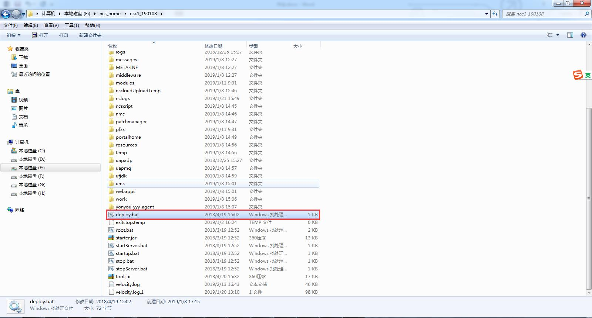
  然后执行bin目录下的sysConfig.bat，配置服务器信息的协议定义，如下图：
  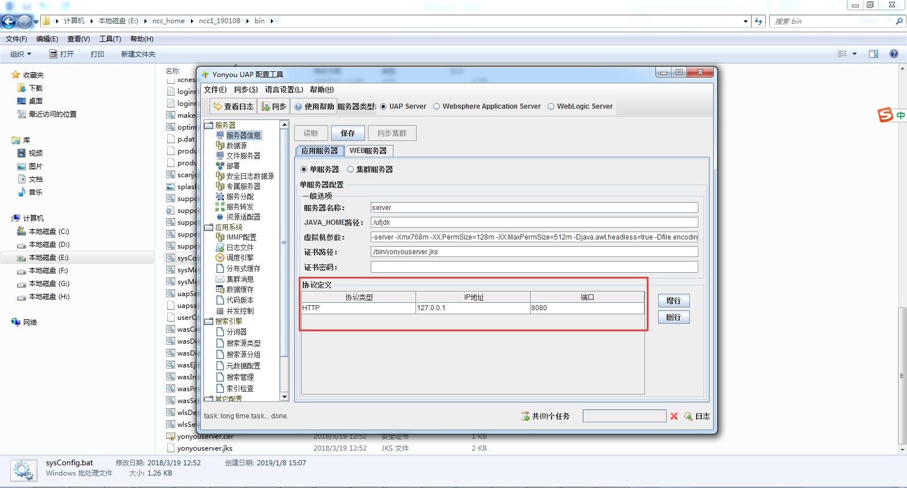
  配置完成后，需要到eclipse开发配置中配置UAP Home路径和数据库信息，点击【ok】，更新类路径，如下图:
  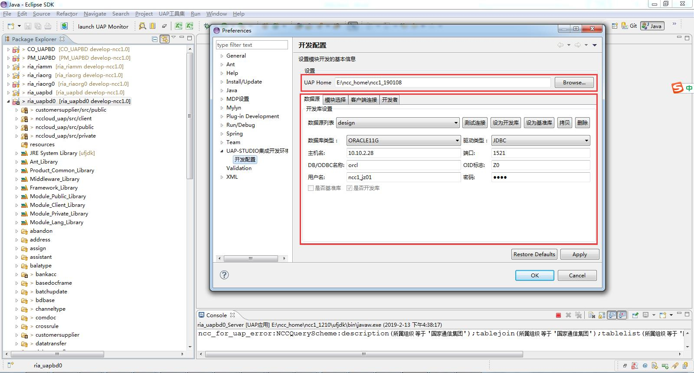
  更新完成后就可以启动中间件了。

 ## 1.2.3	启动
  ### 1.2.3.1	后端启动
  右键ria_riauapbd0模块，启动中间件，如下图：
  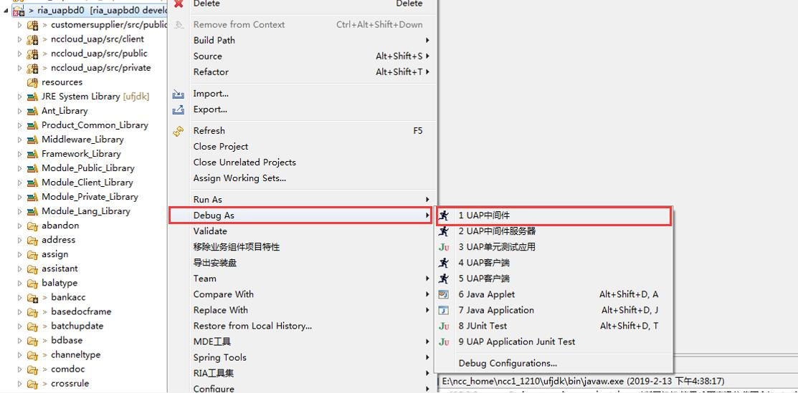
  Eclipse控制台如下图提示，说明启动成功:
  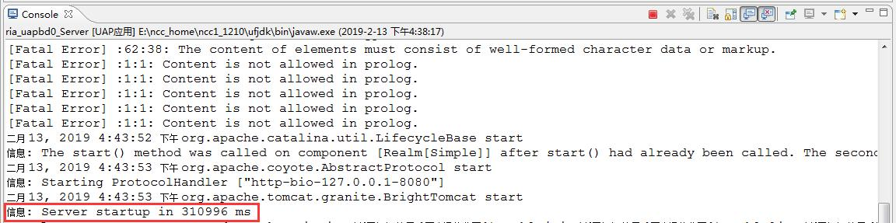

  ### 1.2.3.2	前端启动
  前端在终端中输入npm run dev 启动前端工程。启动成功后vscode终端会提示compiled with successful或者compiled with warnings 都表示前端环境启动成功，如下图：
  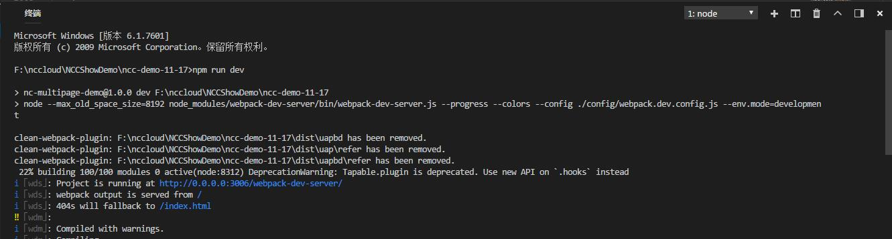

 ## 1.2.4	访问
  启动成功后浏览器地址栏输入http://localhost:3006/nccloud，进行访问，登录成功后，会显示类似下图所示的界面：
  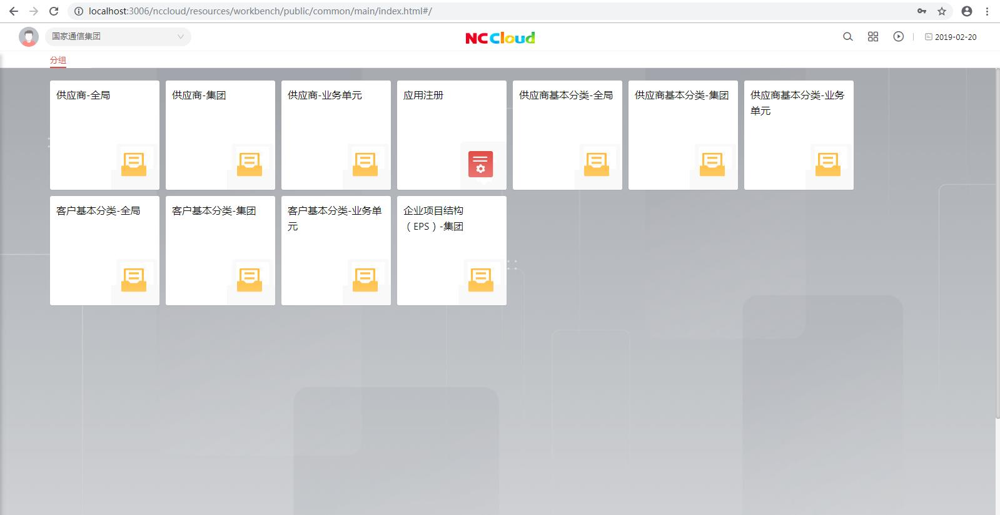
  
  
 ## 注意事项

 暂无

 ## 更新日志