<menu>
{'parent':'测试',
'name':'2.NCC'}
</menu>

# 2	NC Cloud前端组件
## 2.1 概要

平台基于钉耙组件开发http://bee.tinper.org/，并包装为基础组件，通过封装基础组件功能包装为高阶组件。在开发过程中，应该尽可能使用高阶组件和基础组件。基础组件的功能完全包含钉耙组件。
钉耙组件: 底层组件，通过组件基础功能，可参照文档http://bee.tinper.org/
基础组件: 以NC_XXX 形式命名的组件，基于钉耙组件的包装，处理通用样式等。
高阶组件: 基础组件的封装，整合组件功能，处理样式等。
钉耙和基础组件为比较标准的MVVM模式，NC高阶组件对组件进行了方法的包装，通过调用组件方法来驱动视图，
注：
	1：高阶组件提供的方法也是驱动内部的视图模型来改变视图的。
	2：使用基础组件可直接参考钉耙的文档，二者使用方式完全一致。

## 2.2 脚手架

修改config.json中的buildEntryPath属性：配置需要webpack编译的文件，减少不必要的文件编译。值的格式是"./src/reva_demo/*/*/*/index.js"，也可以是数组；
修改config.json中的buildWithoutHTML属性：配置不需要生成html的节点，多用于组件（如uapbd/refer）；
修改config/webpack.dev.config.js中的devtool属性: 将devtool的值改为'eval'或其他，其他值详见https://doc.webpack-china.org/configuration/devtool/#src/components/Sidebar/Sidebar.jsx；
修改package.json中scripts属性的dev属性: 将max_old_space_size的值调大（4096是4G内存）；
参照相关: 如果自己项目里引用的是uapbd的源码，则需要在buildEntryPath里配uapbd；如果引用的是编译好的uapbd，则buildEntryPath里就不用写uapbd了，这样可极大提升编译效率，同时之前大规模出现的"can't resolve 'ReactDOM"问题也得以解决。
其他js文件同理，只要是把编译好的文件放到本地src目录下，buildEntryPath里就不用再配置编译了。

## 2.3 NC Cloud前端公共功能

### 2.3.1 页面初始化

NC Cloud同NC类似，也是存在着单据模板等内容，打开节点的时候通过加载单据模板构建界面，便于开发人员开发，因此在业务代码当中需要显式编写代码实现加载单据模板的过程。同时也需要实现相关平台组件的初始化以及导入。
createPage用于实现平台相关函数的导入过程，从此之后就可以在业务代码当中通过this.props的方式调用平台提供的函数。代码如下：
```
  List = createPage({
	   initTemplate: [],
	    mutiLangCode: '10140TAXRE'
  })(List);
```
可以参考UAPBD前端工程节点：uapbd/taxinfo/taxregion/list/index.html文件。
createUIDom函数主要用于加载在应用注册节点当中注册的单据模板以及相关按钮。此处需要注意的一个点是我们将createUIDom的调用放到了React的componentDidMount生命周期函数当中。这是为了便于先加载多语资源以防在createUIDom的回调函数当中找不到相关的多语资源信息。如下图示：

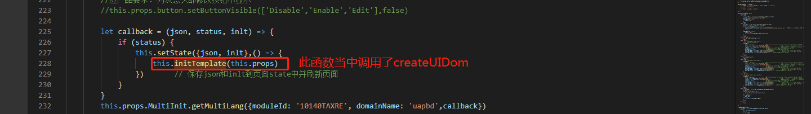

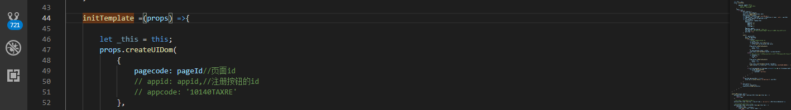

createUIDom的调用需要接收两个参数，详细说明如下：
1.	第一个参数是一个对象，包含了pagecode字段，为节点注册当中的页面编码
2.	第二个参数为回调函数，回调函数的参数当中包含了返回的模板信息以及按钮信息。
对于模板信息通过调用this.props.setMeta()函数设置模板信息，对于按钮信息，通过调用this.props.button.setButtons()设置按钮信息。可以参考UAPBD前端工程节点：uapbd/taxinfo/taxregion/list/index.html文件。

### 2.3.2	布局与样式

布局重要说明: 平台主张web方式布局，所以页面尽可能web布局方式。如果界面中需要用到viewport，需自行处理样式和滚动条问题。平台提供了DragWidthCom(左右布局)组件，此组件是web布局，部分滚动条问题，依然需要NC平台技术解决。
NC Cloud布局标准样式: 平台提供一下几种布局方案，其核心为页面的Dom结构与表单布局Dom结构一致，样式属性名称一致。布局详细参考：http://git.yonyou.com/nc-pub/Public_Document/tree/master/%E5%89%8D%E7%AB%AF/%E6%A1%A3%E6%A1%88%E5%92%8C%E5%8D%95%E6%8D%AE%E5%B8%83%E5%B1%80%E6%A0%B7%E5%BC%8F%E8%AF%B4%E6%98%8E
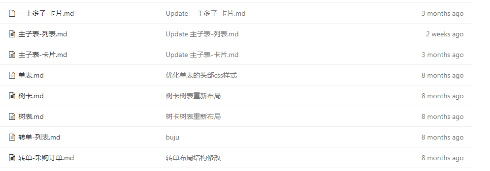
**实例：**
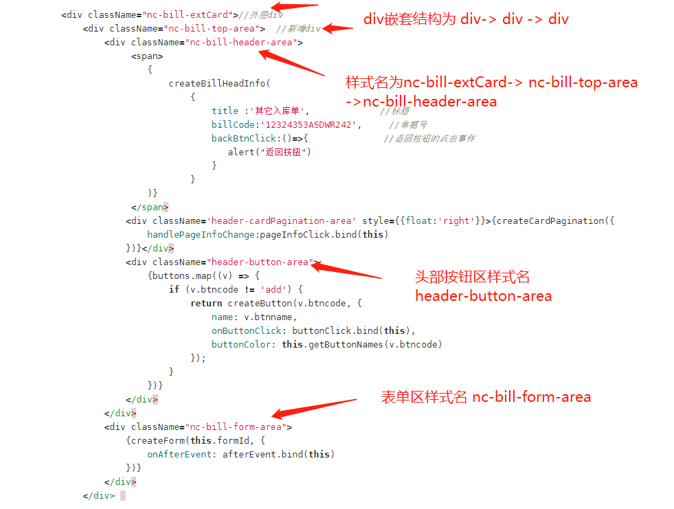
开发时也可以参照界面结构相似的节点。

### 2.3.3	单据模板

多模板多区域模式
单据模板是界面渲染的重点，大部分的界面渲染以及配套函数的调用都是围绕着模板来进行的。单据模板是在NC Cloud的应用注册当中进行配置的，对于与原NC的单据模板初始化节点。下面是以多模板多区域来描述一下单据模板。
许多传统的NC节点都是分为卡片和列表界面，此处以税收地区为例说明。
下面是税收地区的列表界面：

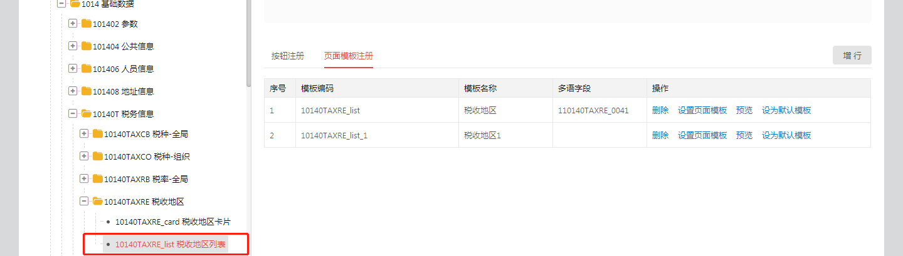

下面是卡片界面：

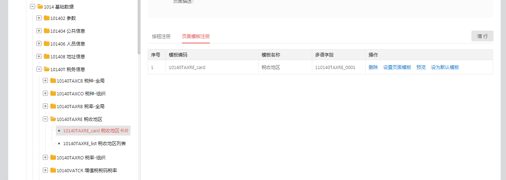

像是卡片界面，会有许多称之为区域的东西：例如主子表，主表将会是一个区域而子表是另外一个区域。每个区域当中都包含了许多的字段，每个字段的属性同原NC的单据模板初始化当中的字段的属性类似。
首先需要在配置界面增加区域：

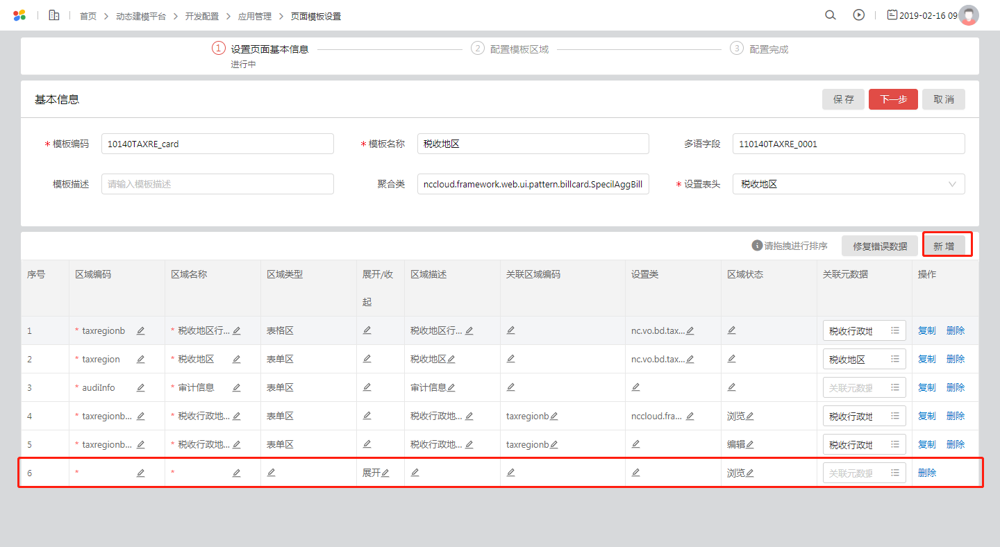

然后可以对每个区域做单据字段配置，如下图所示：

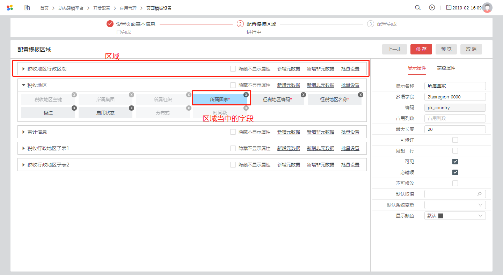

同时可以通过通过元数据的方式增加字段，如下图所示：

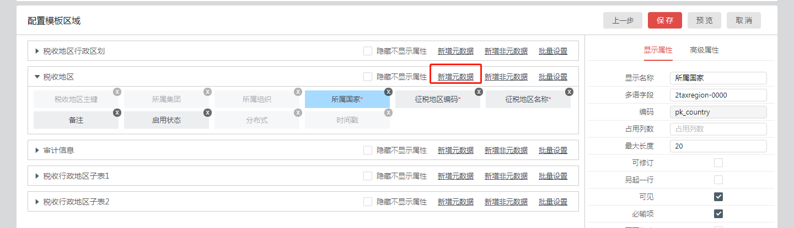

最后点击保存即可。
同时createUIDom方法还会返回一个context信息，打开应用时，createUIDom的合并请求传递到前台的context内容字段说明（和打开应用查询模板、查询按钮的请求一起返回，获取方式同获取按钮的方式）：
```
{
  "data": {
        "pk_org": "GLOBLE00000000000000",  // 默认业务单元主键
```
**取值算法：**
1、先从个性化中心取（会按照是否有权限筛选过滤一遍）；                                                                          2、如果取不到，查询用户有权限的业务单元，如果有权限的业务单元只有一个，那返回该有权限的业务单元。
```
	"org_Name": "全局",  // 默认业务单元名称
	"pk_org_v": "GLOBLE00000000000000",  // 默认业务单元版本主键
	"org_v_Name": null,  // 默认业务单元版本名称
	"defaultAccbookPk": "",  // 默认财务核算账簿主键（会按照是否有权限筛选过滤一遍）
	"defaultAccbookName": "",  // 默认财务核算账簿名称
	"defaultCostRegionPk": "",  // 默认成本域主键（会按照是否有权限筛选过滤一遍）
	"defaultCostRegionName": "",  // 默认成本域名称
	"defaultCreditCtlRegionPk": "",  // 默认信用控制域主键（会按照是否有权限筛选过滤一遍）
	"defaultCreditCtlRegionName": "",  // 默认信用控制域名称
	"mdid": "5e6a2642-ad92-4b56-b817-b290a8f77ee5",  // 元数据实体id
	"dataSource": "new_test",  // 数据源
	"currentLangSeq": "3"  // 当前语种序号

	// 【应用注册】的【参数注册】页签的值：transtype-交易类型编码；pk_transtype-交易类型主键
	"paramMap":{
	    "transtype":"HE-01",  // 交易类型编码
	    "pk_transtype":"0001A310000000004E6I",  // 交易类型主键
	    "transtype_name": "交易类型名称",  // 交易类型名称
	    "0101":"王伟测试参数"  // key为参数名；value为参数值
	 }
 	}
}
```

### 2.3.4	数据缓存方案

数据缓存是方案是为了效率考虑而做的。现在NC Cloud当中每次查询数据都需要发一次ajax请求导致效率低下，因此业务节点可以将查询过的单据信息缓存到浏览器当中，然后下一次再去访问的时候直接从缓存当中取出来，从而提高效率。缓存方案需要业务人员调用相关的平台方法，实现数据的缓存以及读取。
有关内容可以参照UAPBD前端工程节点：uapbd/taxinfo/taxregion/节点当中的文件。
**列表界面的数据缓存方案：**
1.	定义单页应用缓存数据命名空间dataSource。亦即一个字符串。
2.	平台提供领域自己处理缓存数据API

```
	import {cardCache} from "nc-lightapp-front";
	let {setDefData， getDefData } = cardCache;
	/*
	* key：存储数据的key
	* dataSource: 缓存数据命名空间
	* data：存储数据
	*/
	setDefData(key， dataSource， data);

	/*
	* key：存储数据的key
	* dataSource: 缓存数据命名空间
	*/
	getDefData(key， dataSource)

```
3.	给列表表格(createSimpleTable)增加dataSource标识：
```
	//表格加dataSource标识
	//给表格加pkname: 表格数据的主键名字(key)
	createSimpleTable("tableAreacode"，{
	    dataSource: dataSource,
	    pkname: pkname,
	    componentInitFinished:()=>{
	        //缓存数据赋值成功的钩子函数
	        //若初始化数据后需要对数据做修改，可以在这里处理
	    }
	})
```
4.	卡片页面返回列表页面（初始化）时，先判断是否已经存在缓存数据，若存在缓存数据，则不需要重新查询给表格赋值，否则发起查询请求，加载表格数据。注意：查询和刷新按钮需要重新查询，请求后台数据。
5.	删除列表表格数据时，删除成功后，需要调用平台方法deleteCacheId，其他处理逻辑不变。

**卡片界面适配：**
1.	给翻页组件cardPagination添加dataSource标识
2.	卡片翻页查询数据时，先判断是否有缓存数据，若是，取缓存数据给卡片赋值；否则，发起查询请求，并把请求回来的数据更新到缓存中
3.	在列表点新增或在卡片上点新增按钮后，新增保存时，保存成功后，需要调用addCache方法，将数据存储到缓存中
4.	卡片上点击新增按钮后，未保存，又点了取消按钮，则需调用方法getCurrentLastId，获取当前列表最后一条数据渲染界面
5.	卡片修改保存时，保存成功后，需要调用updateCache方法，将数据更新到缓存中
6.	在卡片删除数据时，删除成功后，先通过getNextId获取下条数据的主键，再调用deleteCacheById方法，将缓存数据删除
7.	点击翻页组件时，拿到新的id也要先判断是否存在对应的缓存数据，若存在，则取缓存数据给界面赋值；否则，发ajax请求查询数据，并将查询回的数据更新到缓存中
前端框架同时提供了一份文档，有助于更好的理解缓存方案的实现方式，文档地址如下：
http://git.yonyou.com/nc-pub/Public_Document/blob/master/%E5%89%8D%E7%AB%AF/%E5%89%8D%E7%AB%AF%E6%A1%86%E6%9E%B6/%E5%89%8D%E7%AB%AF%E5%8D%95%E9%A1%B5%E5%BA%94%E7%94%A8%E7%BC%93%E5%AD%98%E9%80%82%E9%85%8D/%E5%88%97%E8%A1%A8%E5%8D%A1%E7%89%87%E5%8D%95%E9%A1%B5%E7%BC%93%E5%AD%98%E9%80%82%E9%85%8D.md

### 2.3.5	页面跳转方案

1. 列表卡片跳转路由方案详情参考平台文档
http://git.yonyou.com/nc-pub/Public_Document/blob/master/%E5%89%8D%E7%AB%AF/%E5%89%8D%E7%AB%AF%E6%A1%86%E6%9E%B6/%E5%89%8D%E7%AB%AF%E5%8D%95%E9%A1%B5%E5%BA%94%E7%94%A8%E7%BC%93%E5%AD%98%E9%80%82%E9%85%8D/%E5%88%97%E8%A1%A8%E5%8D%A1%E7%89%87%E5%8D%95%E9%A1%B5%E7%BC%93%E5%AD%98%E9%80%82%E9%85%8D.md
2. 以银行账户节点为例，结算信息sminfo下bankAccount_base，bankAccount_forg，bankAccount_grp 三个组件，main代表节点列表态，edit代表节点的卡片态，集团和财务组织组件，除了main和edit还有router 存放路由相关js，router下有index 和router，详细解释如下图

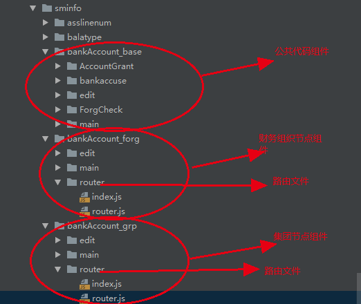

Router/index.js

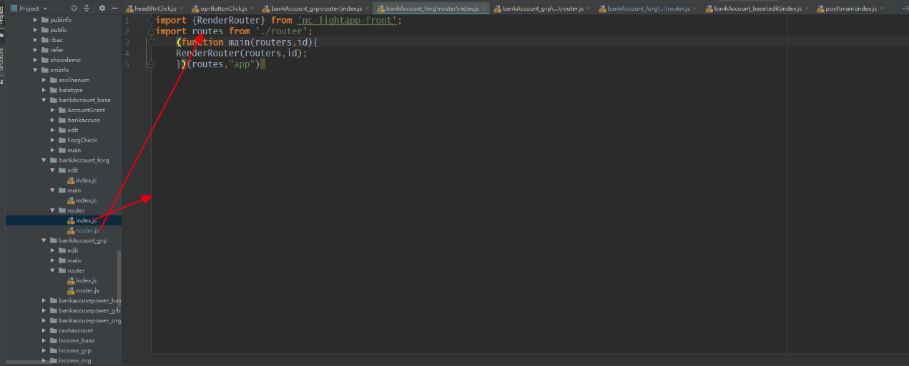

列表的路由注册路径为"/list"，卡片的路由注册路径为"/card"。
则：列表跳卡片代码：props.pushTo("/card",{})；卡片跳列表代码：props.pushTo("/list")。

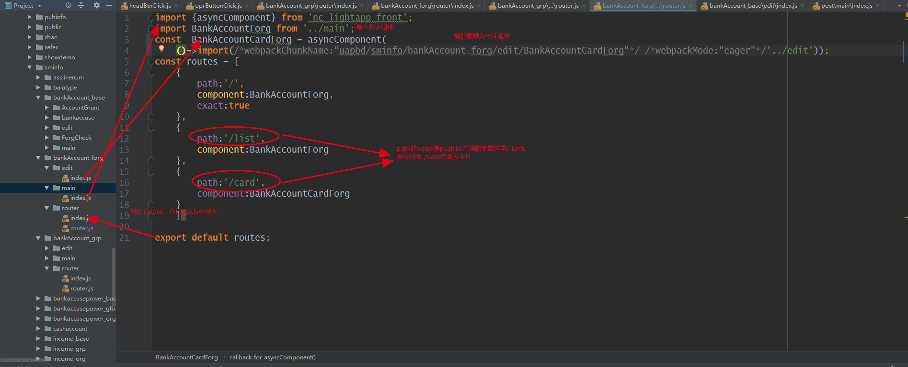
