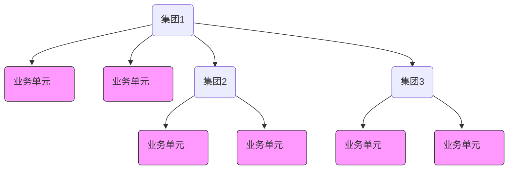
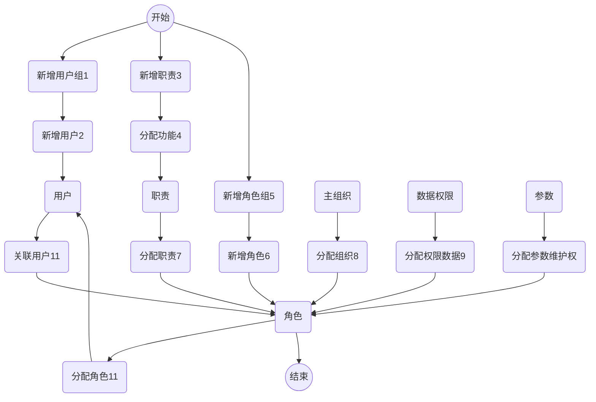

<menu>
{'parent':'demo',
'name':'index'}
</menu>

 企业架构动态建模2 

---
---
>* <h2>课程目录</h2>
[TOC]
---

# 一、课程介绍

## 1、简介与目标

* 简介：介绍动态建模基本概念和操作流程
* 目标：在开发/测试环境中建立集团模型

## 2、学习与要求

- 课程对象：分支机构实施/开发序列中级（含）以上开发顾问。
- 课前学习：开发环境安装与配置

# 二、动态建模概念

- 以NC Cloud产品的组织/权限等概念，模拟集团的实际组织/角色的过程称为建模。建立集团组织模型的过程，以及建立之后的运行过程中，组织架构、业务流程、权限分配等均可即时配置生效，即建模过程为动态控制，称为动态建模。

# 三、组织建模
- 以 **账套管理员** 身份登录进行组织建模，示例模型如下图所示：

## 1、创建集团
- 点击【集团管理】进入集团管理页面，如下所示：

- 点击【新增】录入所有必录项目后，点击【保存】，如下图所示：

## 2、创建集团管理员
- 点击【集团管理员】进入集团管理页面，如下图所示：

- 点击【新增】录入所有必录项目后，点击【保存】，如下图所示：

>* 集团管理员保存成功后，点击【设置默认密码】，设置集团管理员登录密码。

>* 如果忘记登录密码，点击【密码重置】，系统会给出一组默认密码，用于集团管理员默认密码登录后重置密码。

## 3、业务初始化
- 点击【业务初始化】进入业务初始化页面，如下图所示：

- 点中左侧树结构中的【Group 演示集团】，点击【启用模块】进入选择模块模态框，将所有模块由左框移至右框，如下所示：

>* 点击【确定】后，进行增补进度条，最后显示增补成功，如下图所示：
注：应用注册新增模块后，需要在这里业务初始化，不然用户登录后看不到新增模块。

## 4、系统参数设置
- 为方便开发人员调试，建议将系统参数中“是否启用管理权限与业务权限互斥”设为“否”，允许开发环境中用户同时映射管理型角色和业务型角色。
- 点击【系统参数设置】进入系统参数设置页面，如下图所示：

# 四、权限建模
- 以 **集团管理员** 身份登录进行权限建模，示例模型如下图所示：
## 1、权限模型关联关系
- 大型企业中管理架构较为复杂，如何实现哪些人能做哪些事？由此产生了企业的权限模型。企业权限建模由用户、角色、职责三个核心概念组成，角色又分为管理类角色和业务类角色，职责又分为管理型职责和业务型职责。

>* 权限管理的实施步骤建议按照1、2、3……顺序进行
>* 图中，用户、职责和角色的创建顺序是并行的，流程分支不分先后顺序
>* 并非每个步骤都必须，如图中的“9分配数据权限”和“10分配参数维护权”，在某些特殊情况下才需要配置

## 2、创建业务单元
- 通过创建业务单元建立公司和其他业务单元，公司组织职能必须有【法人公司】，同时也具有【财务】职能。点击【业务单元】进入新建业务单元页面，如下图所示：

- 点击【新增】录入业务单元必录信息，公司职能必须勾选【法人公司】【财务】，点击【保存】。如下图所示：

## 3、创建部门档案
- 点击【部门】进入新建部门页面，如下图所示：

- 在部门页面中左侧部门处选择组织参照，然后在部门树的根节点上点“+”新建部门，录入部门信息后点击【保存】，如下图所示：

## 4、创建用户组
- 点击【用户组】进入新建用户组页面，如下图所示：

- 点击【新增】录入用户组必录信息，点击【保存】。如下图所示：

## 5、创建用户
- 点击【用户】进入新建用户页面，如下图所示：

- 点击【新增】录入用户必录信息，点击【保存】。如下图所示：

## 6、创建职责
- 职责分为 **管理类职责** 和 **业务类职责**
- 职责只能分配给相应类型的角色
- 点击【职责-集团】进入新建职责页面，如下图所示：

### 创建管理类职责
- 点击【新增】录入职责必录信息，注意 **职责类型** 选择【管理类型】，点击【保存】。如下图所示：

### 创建业务类职责
- 点击【新增】录入职责必录信息，注意 **职责类型** 选择【业务类型】，点击【保存】。如下图所示：

### 职责分配应用
- 新建职责后需给职责分配功能权限
- 业务类职责和管理类职责都需要分配相应功能权限
>* 管理类职责分配应用

>* 业务类职责分配应用
**注：客户化开发模块及业务，应该在业务类职责中分配**

## 5、创建角色组
- 新建角色时，角色必须属于一个角色组，因此需要先建立角色组
- 角色组在一个组织（集团或业务单元）内支持多级
- 角色组分为 **管理类角色组** 和 **业务类角色组**
- 点击【角色组】进入新建角色组页面，如下图所示：

- 创建管理类角色组
点中左侧角色组树中的管理类型，点击【新增】录入角色组必录信息，注意 **角色组** 类型选择【管理类角色】，点击【保存】。如下图所示：

- 创建业务类角色组
点中左侧角色组树中的业务类型，点击【新增】录入角色组必录信息，注意 **角色组** 类型选择【业务类角色】，点击【保存】。如下图所示：

## 6、创建角色
- 创建管理员权限的用户时，创建 **管理类角色**
- 在进行业务操作的用户时，创建 **业务类角色**
### 创建管理类角色
- 点击【管理类角色】进入新建管理类角色页面，如下图所示：

- 点击【新增】录入角色责必录信息，注意 **角色组** 选择【角色组_管理_集团】，点击【保存】。如下图所示：

### 创建业务类角色
- 点击【业务类角色】进入新建业务类角色页面，如下图所示：

- 点击【新增】录入角色必录信息，注意 **角色组** 选择【角色组_业务_集团】，点击【保存】。如下图所示：

### 关联用户
- 管理类角色关联用户
在管理类确色卡片中，选择 **已关联用户** 页签，点击【关联用户】，选择组织带出其下的用户组，以用户组维度添加用户，如下图所示：

- 业务类角色关联用户
在业务类确色卡片中，选择 **已关联用户** 页签，点击【关联用户】，选择组织带出其下的用户组，以用户组维度添加用户，如下图所示：

### 分配职责
- 管理类角色分配职责
在管理类确色卡片中，选择 **已分配职责** 页签，点击【分配职责】，选择已创建的管理型职责，如下图所示：

- 业务类角色分配职责
在业务类确色卡片中，选择 **已分配职责** 页签，点击【分配职责】，选择已创建的业务型职责，如下图所示：

### 分配组织
- 管理类角色分配组织
在管理类确色卡片中，选择 **已分配组织** 页签，点击【分配组织】，选择已创建的组织，如下图所示：

- 业务类角色分配组织
在业务类确色卡片中，选择 **已分配组织** 页签，点击【分配组织】，选择已创建的组织，如下图所示：

### 角色关联用户
- 在 **用户** 卡片中，点击【分配权限】，给用户分配角色，如下图所示：

- 在 **用户权限分配** 页面中，点击【分配角色】，可以给用户分配管理型或是业务型角色，如下图所示：

- 以 **用户** 登录前端，如下图所示：

## 7、设置开发者
### 创建研发者机构
- 新建研发者机构，并指定 **机构类别** 区分研发人员对应机构的标识别，设置 **所属层次** 是指定对应研发级别，即iuap studio for ncc中新增实体组件时的开发维度。
- 以 **集团管理员** 身份登录副客户端，新建研发者机构，录入机构类别、所属层次、认证伙伴编码等信息为 **伙伴级** 机构，后续在开发工具中扩展开应用，产品默认机构的所属层次为 **领域级**, 如下图所示：

- 开发维度在进行扩展开发时使用，要对某个维度的组件进行扩展，必须采用高于该开发维度的研发机构对应的开发者进行开发。
### 创建研发者
- 产品开发者默认为 **领域级**，扩展开发是需要添加 **伙伴级** 开发者。在开发者管理节点下配置开发者信息，添加 **领域级** 开发者，如下图所示：

>* 在开发者管理节点的开发者卡片页签下进行配置，在表体的【关联的用户】、【用户信息】页签点击右方的新增按钮新增开发者用户，新增开发者用户和新增普通用户相同，需要有所属组织和所属用户组等初始信息，生效日期移至当前日期之前，否则在iuap studio for ncc中可能参照不到，新建的开发者用户密码为系统默认初始密码。
### 开发工具配置开发者
- 开发人员使用开发工具时，需要设置开发者信息，以标识当前开发成果所属级别。
- 在iuap studio for ncc的【窗口】-【首选项】-【UAP-STUDIO集成开发环境】 - 【开发配置】 - 【开发者】
- NC产品中已预置领域级开发者信息，非扩展开发时无须设置开发者

# 五、课程演练
- 1、组织建模
- 2、权限建模
- 3、设置开发者
