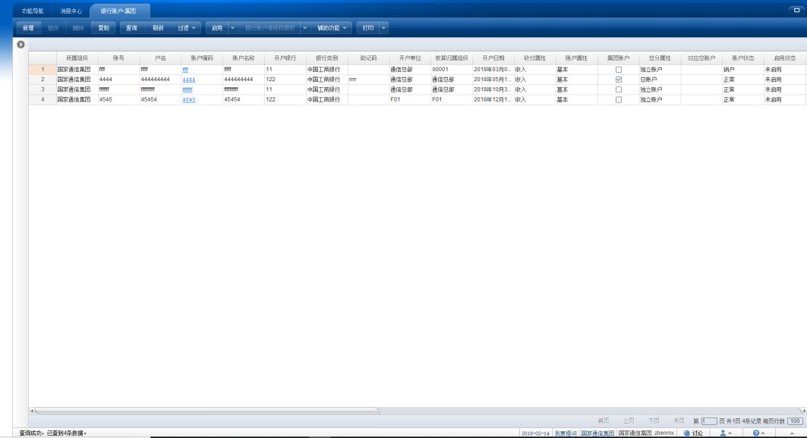
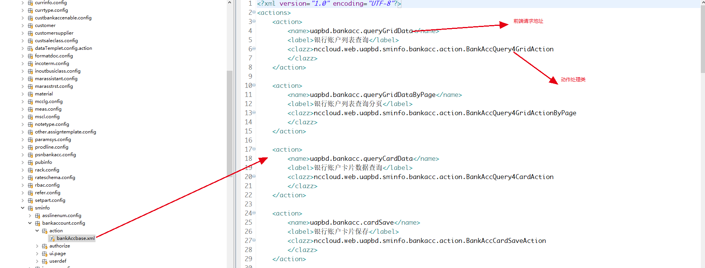

<menu>
{'parent':'4.节点开发实例',
'name':'4.2主子表开发实例'}
</menu>

## 4.2 主子表开发实例
### 4.2.1 简介
　　以银行账户节点（bankacc）为例，一个银行账户单据由银行账户（bd_bankaccbas）和银行账户子户(bd_bankaccsub)组成，一对多关系。节点形态分为列表态和卡片态，列表态是银行账户主表的列表，卡片态是通过对列表某条数据的双击，修改，或者复制进入，形态是主表卡片展示，加上子表bankaccsub的列表。  
　　NC银行账户节点列表展示：  

NC银行账户节点卡片展示：  

NC Cloud银行账户节点列表展示:  

NC Cloud银行账户节点卡片态展示：  

### 4.2.2 开发流程
#### 4.2.2.1 前端布局
　　具体主子表档案布局请参照平台文档http://git.yonyou.com/nc-pub/Public_Document/tree/master/%E5%89%8D%E7%AB%AF/%E6%A1%A3%E6%A1%88%E5%92%8C%E5%8D%95%E6%8D%AE%E5%B8%83%E5%B1%80%E6%A0%B7%E5%BC%8F%E8%AF%B4%E6%98%8E  
　　前端列表布局  

　　前端卡片布局　　

#### 4.2.2.2 前端代码结构

　　银行账户节点分为组织级节点和集团级节点，公共代码放在base里面，通过传入不同的配置，实现打开不同的节点。前端代码结构，edit里面是卡片态的内容，main是列表态的内容，和edit，main同级的是其他组件，结构划分，命名规范因人而异，不做强制要求，main和edit下一级的events放事件js分为点击事件（clickEvents）如按钮点击事件和监听事件（afterEvents）如表体编辑前，编辑后事件，节点的入口在main下的index.js ，具体布局参考平台文档  

　　如上图，以银行账户-集团节点为例，在bankAccount_grp/main/index.js中导入公共代码BankAccountBase，定义集团节点参数，通过createPage方法返回一个BankAccountBasePage，在定义一个代表集团节点的组件BankAccountGrp并且导出。  

　　主子表卡片列表切换都使用平台提供的路由方案pushTo，具体文档参考http://git.yonyou.com/nc-pub/Public_Document/blob/master/%E5%89%8D%E7%AB%AF/%E5%89%8D%E7%AB%AF%E6%A1%86%E6%9E%B6/%E9%A1%B5%E9%9D%A2%E8%B7%B3%E8%BD%AC%E8%AF%B4%E6%98%8E.md。  
　　在集团，全局节点组件里面除了main和edit还有同级的router文件夹，包含两个文件router.js和index.js具体导入导出关系参考上面两幅图。  

#### 4.2.2.3 后端代码结构

　　银行账户的后端代码在uapbd0下的结算信息下的bankacc里面 action里面是动作处理类，extendRef里面节点用到的参照如果有特殊条件扩展类放到这里，utils放一些自用的工具类，这些代码都是在uapbd0层的client端如下图，代码在蓝色选中的文件夹下，配置文件和代码同级都在client下。  

上图中action里面  

　　节点的鉴权文件代表这个节点能够发送的请求，如果前端代码里面的所有请求都要配置在这个文件里面，想当于一个请求白名单。  

　　下图是一个查询列表的action详解：  
　　所有的action都必须实现ICommonAction接口，具体逻辑重写doAction方法：  

