<menu>
{'parent':'4.节点开发实例',
'name':'4.4单表开发实例'}
</menu>

## 4.4 单表开发实例
### 4.4.1后端部分
#### 4.4.1.1请求实现类Action与配置
Action实现类需写在client端

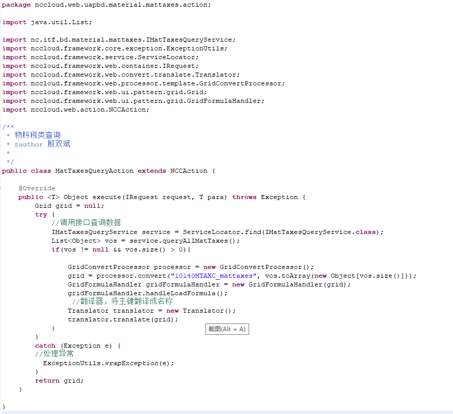

在client端创建对应的package包及xml文件，编制请求路径与Action实现类对应关系

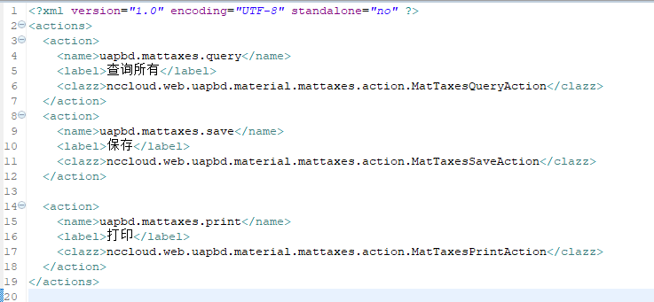

注：xml文件中name属性需要三段值，例如：uapbd.mattaxes.query

#### 4.4.1.2 鉴权设置
同样在client端创建对应package包及xml文件，配置鉴权信息对应关系

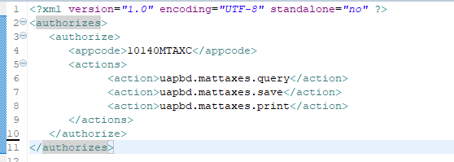

说明：appcode为10140MTAXC的小应用具有actions属性类别下的请求权限，不在此处配置，则无权。

### 4.4.2 前端部分
#### 4.4.2.1 节点注册
管理员登录NC Cloud系统，进入动态建模平台>开发配置>应用管理>应用注册节点，注册应用，如图：

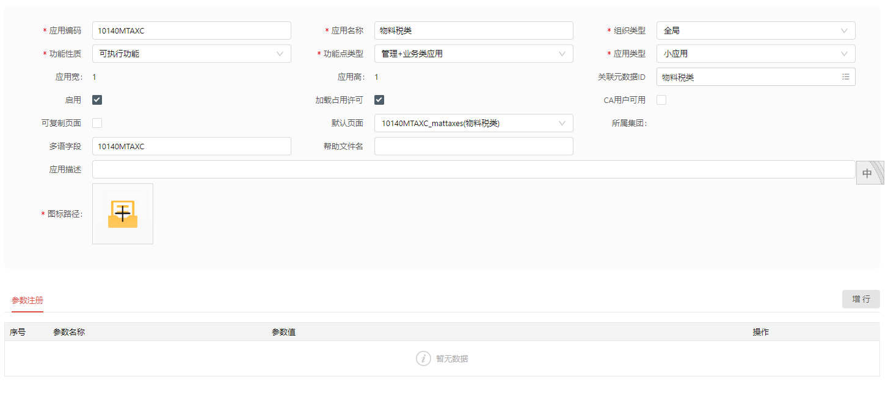

在新增加的应用下增加页面，如图:

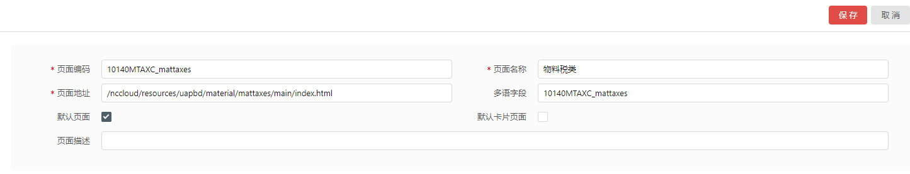

#### 4.4.2.2 模板注册
在新增加的应用页面内增加模板，并配置信息

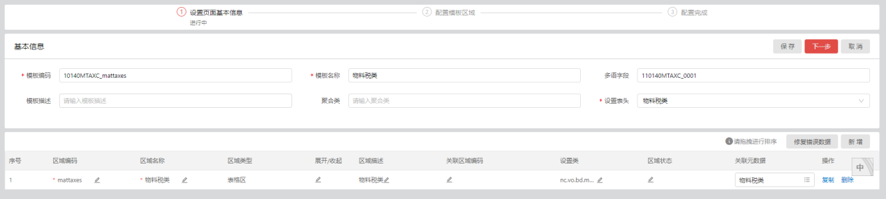

点击下一步，配置模板区域字段，此处根据需求具体配置所需字段

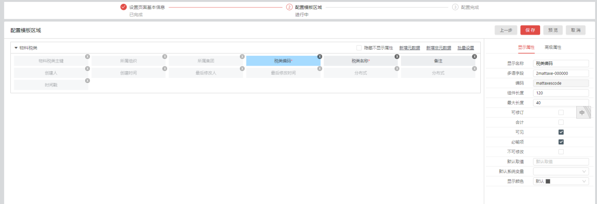

#### 4.4.2.3 按钮注册
在新增加的应用页面下增行添加按钮：

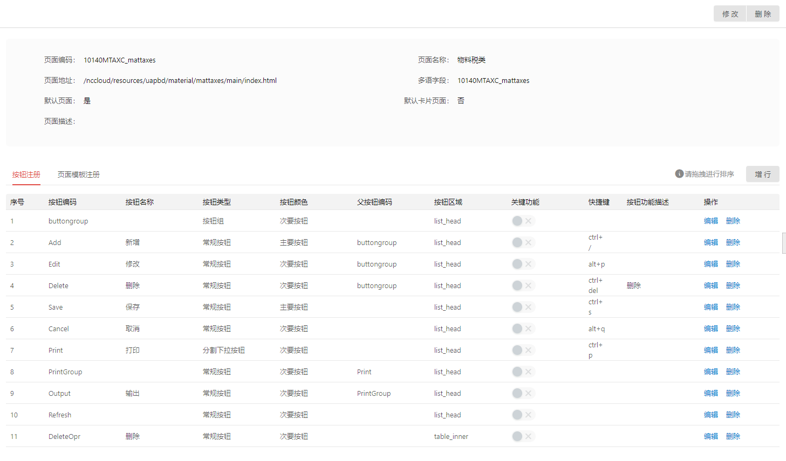

#### 4.4.2.4 菜单注册
开发环境下，进入动态建模平台>开发配置>应用管理>菜单注册应用，注册菜单：

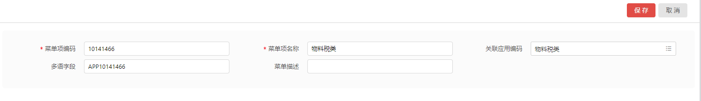

#### 4.4.2.5 createUIDom页面初始化
引入React组件：

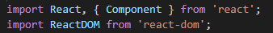

引入平台组件：

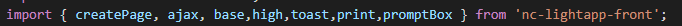

创建class并渲染页面

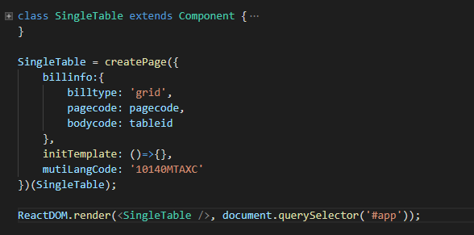

获取页面初始数据：

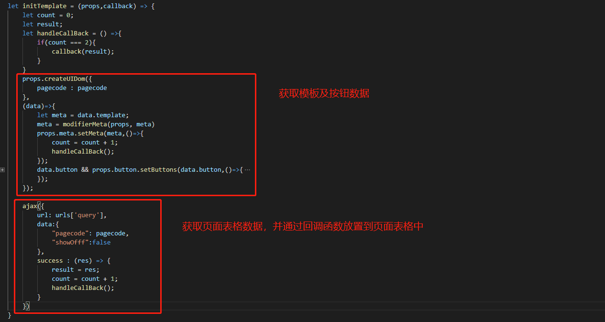

#### 4.4.2.6 编写dom页面结构
单表使用前端组件editTable（可编辑表格组件）
页面布局结构参见2.3.2布局与样式
实例代码如下：

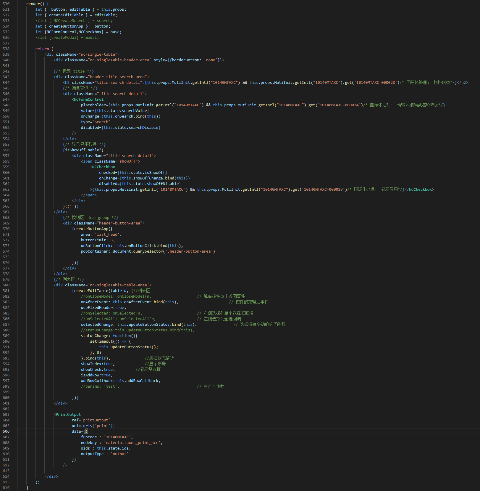

#### 4.4.2.7 请求页面数据
编辑表格节点在大多数情况下，都需要页面初始化时请求到列表数据（视不同需求场景），可以将请求表格数据抽出单独方法，方便查询、刷新等操作时直接调用。

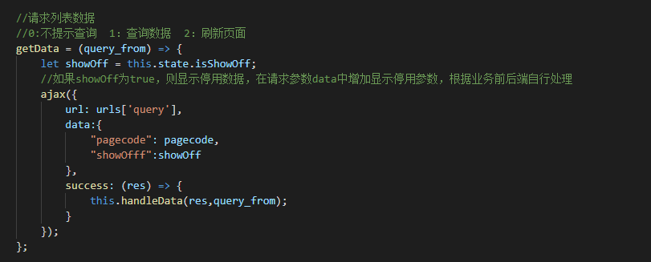

#### 4.4.2.8 编写按钮事件
上文提到通过 createUIDom 方法获取页面模板信息，该方法会同时获取到页面注册的按钮的全部信息，可以通过setButtons方法将按钮信息放置到meta中。

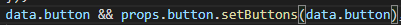

在编写dom结构时，创建按钮区域

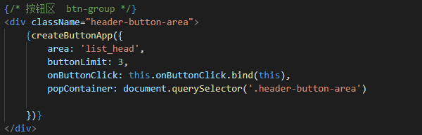

通过onButtonClick钩子方法监听按钮点击事件，来实现事件点击操作。

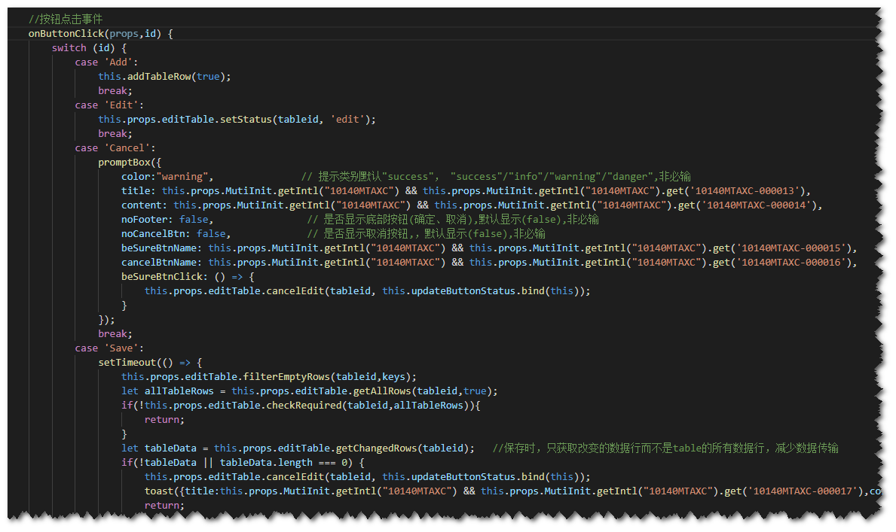

#### 4.4.2.9 更新按钮状态
按钮状态指：按钮的显示与隐藏、按钮是否可用。
在页面初始化、新增、修改、保存、选择数据等多个操作时，都需要更新按钮状态，将按钮状态抽离成方法，在需求场景下方便调用。

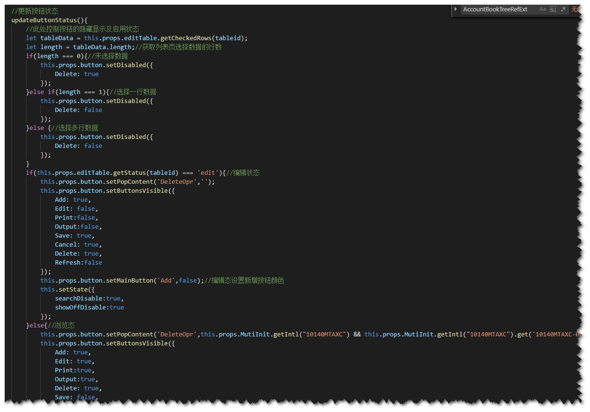