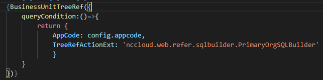

<menu>
{'parent':'4.节点开发实例',
'name':'4.1参照开发实例'}
</menu>

## 4.1 参照开发实例
### 4.1.1 NC Cloud参照开发实例
#### 4.1.1.1 NC Cloud参照基本信息

　　参照，即对其它实体信息的参考和对照。我们要做的就是在数据库中查询到相关信息并最终展示在界面上。NC Cloud中参照具体展示如下图：

图 4-1-1-1

图 4-1-1-2

原NC系统中参照如下：

图 4-1-1-3

参照具体而言，分为树型参照，表型参照，左树右表型参照。图4-1-1-2所示即为树型参照，其它两种参照如下所示：

图 4-1-1-4 表型参照

图 4-1-1-5 左树右表型参照

#### 4.1.1.2 NC Cloud参照前端开发
　　基于现有的NC Cloud参照框架，参照的通用功能及界面展示都统一实现了，再开发新参照极为方便（注:绝大部分参照都是基于原NC系统参照开发）。NC Cloud前端使用的是react框架，我们只需要配置好参照组件的props，通过改变props来改变界面显示（具体前端功能实现参见BaseRefer.js 和 PopRefer.js及git文档，地址:
<a href="http://git.yonyou.com/nc-pub/Public_Document/tree/master/%E5%89%8D%E7%AB%AF/%E5%89%8D%E7%AB%AF%E6%A1%86%E6%9E%B6/%E5%8F%82%E7%85%A7" target="_blank">NC Cloud参照前端开发相关</a>
），如下图所示（以资产组织参照为例）：

图 4-1-2-1 资产组织表型参照前端配置

　　conf中各参数具体含义请参见附表，这里简单介绍一下上图中conf各参数：  
　　multiLang对象为多语配置，其中domainName为领域模块名，大部分参照所属领域均为uapbd，少部分为uap。  
　　currentLocale为默认语言，当前为简体中文，moduleId为多语文件名  
　　refType为参照类型，这里为grid-表型，还有tree-树型和gridTree-左树右表型  
　　refName为参照名即弹出框显示的标题名  
　　queryGridUrl对应参照配置文件中的action Name（后续在4.1.1.4中会提到配置相关，此处不再赘述），树型参照为  queryTreeUrl，左树右表型参照，两个属性都要配置   
　　treeConfig：树的显示配置，树型参照只支持显示编码名称两列，表型参照对应的该配置为columnConfig，表型参照能显示多列（当配置超过3列时，表型参照会显示列的配置按钮）。对象中name属性为显示名称，code为显示名在代码中对应的字段。Name和code需要按顺序一一对应。基于原NC所做的表型参照具体显示哪几列依赖于原NC中参照的配置，在下一节详细说明  
　　IsMultiSelectedEnabled是否开启多选，不配置默认为false  
　　unitProps:参照左上角过滤参照的配置  
　　isShowUnit:是否显示左上角过滤参照  
　　这里注意一点，部分参照可能会有引用其他参照的情况，如下图： 

图 4-1-2-2

　　业务单元参照引用了集团参照作为过滤，及业务单元的数据显示需要根据所选集团过滤。此时，业务单元参照js中需import对应的集团参照配置并设置props中相关参数，集团参照中对应要export其props配置。其余的导入导出为参照通用导入导出。  
　　部分特殊参照可能需要改变显示界面，如多增加一个新增按钮，增加一个checkBox复选框等，这种情况需要我们自己写一个类继承PopRefer（若原NC参照引用了业务单元参照作为过滤，则需要继承ReferWithUnit），并在其中复写区域渲染方法（render*()方法）以及发送后端请求方法（getParam()方法），具体实现参见上述git文档，也可以参考一下银行档案参照例子，代码路径:src/uapbd/refer/bankacc/BankDocDefaultGridTreeRef

#### 4.1.1.3 NC Cloud参照后端开发
　　如上一节中所提到的，NC Cloud参照是基于NC参照开发的，后端java文件也是根据原NC参照编写的，原NC参照中存在的语句在NC Cloud中需要加上对应语句。我们所写的部分主要目的是为了拼接查询sql语句，再在公共代码中去执行，最后再对查询的结果进行一些处理并返回给前端。若原NC为表型参照，现NC Cloud的后端java类需要继承DefaultGridRefAction，若为树型参照，现NC Cloud的java类需要继承DefaultTreeRefAction。对于左树右表型参照，加载时是先加载左边的树，点击树上某一节点后加载对应右表数据，两次请求，所以拆开为树表两个类。类中具体编写内容如图4-1-3-1所示（以资产组织参照为例）。一般NC Cloud参照类中只需要写5处内容。  
　　构造方法中设置管控模式，数据权限，停启用相关参数（在NC Cloud参照详解中会详细介绍）  
　　getRefMeta()方法中设置RefMeta对象各属性对应的String值，即sql语句中我们需要查询的字段，以及设置要查询的表名  
　　getExtraSql()方法会拼接Sql语句中where 后的条件语句  
　　getExtralSqlParameter()设置预编译部分的真实数据  
　　getOrderSql()方法设置sql语句中的order by内容。  

图 4-1-3-1 NC Cloud参照

图 4-1-3-2 原NC参照

　　从图上来看，2、3、4序号对应的是参照的主键、名称和编码（若是树型参照还需要设置refMeta的pidField，即父节点主键），1对应的是我们需要查询的其他字段，例：若需要查询pk_org，即设置refMeta.setExtraFields(new String[]{“pk_org”})。8为需要查询的表，一般是实体vo中默认对应的表，部分情况需要自己写子查询拼表。原NC代码中若含有5，说明该参照是有停启用字段的，NC Cloud代码中也要加上5，设置默认不显示被停用数据。6设置数据权限资源code，后续再详细说明。7为设置order by语句。不重写该方法会默认按refmeta中的codeField排序。一般若要给参照查询sql语句加额外where条件，需要写在getExtraSql()方法中，一般对应原NC中的getEnvWherePart()方法，上图NC Cloud参照中在getExtralSql方法中拼接了集团主键条件是因为原NC参照类的父类中重写了getEnvWherePart()方法并在其中拼接了该条件（左树右表型参照不同，树型参照类中getExtraSql方法对应原NC参照类中getClassWherePart方法，表型参照类中的getExtraSql方法对应原NC参照类中getEnvWherePart方法）

#### 4.1.1.4 参照相关配置
　　在编写完前后端代码后，还需要完成一些配置工作才能保证参照可用  
　　在基准库数据库表bd_refinfo中注册ncc参照，即在bd_refinfo表中设置要注册参照的refpath字段为参照前端js文件对应路径，如：  

图 4-1-4-1

　　抽取基准库脚本。要保证所做的改动在新环境上也有，需要抽取预置脚本。找到参照所在工程中的脚本抽取文件，如

图 4-1-4-2

　　编写参照action的映射文件和authorize鉴权文件。在这两个文件中加入新写的参照信息，这样就能保证前端根据参照js中国的url能够在后端找到对应的action。文件地址位于对应工程的如下目录。

图 4-1-4-3 参照action配置文件

图 4-1-4-4 参照鉴权配置文件

至此，一个简单的NC Cloud参照已编写完毕，可以自行测试。测试页面地址为：
<a href="http://localhost:3006/uapbd/demo/refer/index/index.html" target="_blank">http://localhost:3006/uapbd/demo/refer/index/index.html</a>
。在测试前，需要将新写的参照添加到测试页面中（编写内容参照前端uapbd/demo/refer/inxdex 文件夹中内容）：

图 4-1-4-5 参照测试页面内容

图 4-1-4-6 参照测试页面个人区域js

若要详细了解NC Cloud参照，请阅读NC Cloud参照详解

### 4.1.2 NC Cloud参照详解

#### 4.1.2.1 参照后端流程
顺着参照的父类跟踪代码，可以看到最终会执行DefaultTreeRefAction/DefaultGridRefAction类中的processData方法，如下图：

图 4-2-1-1

　　在语句1中一般获取的是参照本身，若前端传参中带有额外拓展的sqlBuilder，则也一并获取，最后会在构造sql语句中用到，先拼接参照本身的extraSql，再拼接额外拓展sqlBuilder的extraSql。语句2是初始化处理器的refMeta和refSqlbuilder。  
　　在语句4和语句6中可以对查询出的结果进行处理，参照类可以重写该方法，对结果进行去重，排序等处理。语句7是构造返回到前端的数据结构。语句3则是拼接sql语句并查询符合条件的主键，详细过程请自行跟代码，这里重点讨论一下where后条件sql的拼接过程，如下图所示：
图中为NCGridRefDBProcessor类中的getWhereSql方法

图 4-2-1-2

主要的where后条件sql拼接过程就在类DefaultRefSqlBuilder中
getExtraSql方法中：

图 4-2-1-3

可以看到也是分为4个部分，第一个拼接的业务定义额外拓展sql条件对应原nc业务节点代码中的addWherePart等方法。关于拓展sql条件的使用，见下图（具体前后端传参交互将在下一小节中详细介绍）：
前端需要在参照queryCondition中添加参数：GridRefActionExt/TreeRefActionExt 
后端需要写一个实现IRefSqlBuilder接口的类，类中重写getExtraSql和getExtraSqlParameter方法。

图 4-2-1-4

第二部分为拼接管控模式可见性sql语句，对应原NC参照中的VisibleUtil.getRefVisibleCondition方法（一般位于原NC参照的getClassWherePart或getEnvWherePart方法中），现在提取出来统一加到公共代码中。使用时，若原NC参照中有该语句，则在NC Cloud参照中的构造方法中添加如下语句:
setMdClassId(IBDMetaDataIDConst.CUSTOMER)，参数为参照对应元数据id。
第三部分为拼接停启用条件语句。若原NC参照中有图4-1-3-2中语句5，则在NC Cloud参照构造方法中需要加入图4-1-3-1中语句5.
第四部分为拼接数据权限条件语句。若原NC参照中有有图4-1-3-2中语句6，则在NC Cloud参照构造方法中需要加入图4-1-3-1中语句6.
NC Cloud中加入这些语句后，前端再传参数就能控制是否拼接各部分sql条件语句了。详细的sql构造过程参见DefaultRefSqlBuilder类，跟踪代码一目了然，此处不再赘述。

#### 4.1.2.2 参照前后端交互

前端向后端传递的参数在后台会被转化为TreeRefQueryInfo结构，如下图：

图 4-2-2-1

业务节点控制查询sql语句的参数一般都在queryCondition中，一般常见的参数见nccloud.web.refer.IRefConst，里面定义了一些常用参数。
前端向参照queryCondition中加入相应键值对即可，若参照为单据模板上定义参照，则需改meta，如：

图 4-2-2-2

若参照为js内import的参照，则写法为：

图 4-2-2-3

此处补充一点，业务节点若要控制参照的界面展示，需要写类似图4-4-2-3中语句1，具体控制参数在后续会详细列出。
对于前端参照queryCondition中内容，有三个方面经常用到。
主组织权限：

图 4-2-2-4

用户在组织类型参照中只能看到其关联角色已分配的组织即为主组织权限。一般而言，带管控模式的节点中，XXX-业务单元节点会有参照必输项-所属组织（或其他名字，但一定是组织类参照，如客户-业务单元节点中的查询区域和卡片区域的所属组织参照必输项），该参照的queryCondition里就必须加上该条件，保证其走主组织权限，如图所示情况参照需要添加主组织权限：

图 4-2-2-5

AppCode为业务节点应用编码，TreeRefActionExt为拓展条件类，在PrimaryOrgSQLBuilder类中，会根据当前登录用户和appcode去查询用户有权限看到的组织PKs，并调用setFilterPKs（PKs）方法，最终，该组织类参照查询的结果会在这些组织里过滤。
数据权限：

图 4-2-2-6

若原NC参照中有图4-1-3-2中6语句，则该参照要走数据权限。
参数1决定了后端是否拼接数据权限sql（图4-2-1-3中的数据权限条件），参数2为数据权限的使用场景，不传后端默认为default，不同的业务节点该值可能不同，业务节点自己需要明确。启用后，若用户在数据权限节点设置了该档案在该场景下的数据权限，则在后端查询sql条件中会拼接对应的数据权限sql语句。
管控模式可见性：

图 4-2-2-7

若业务节点使用的参照为带有管控模式的参照（即物料-全局，物料-集团，物料-业务单元这种类型的参照），则要根据业务节点类型传对应的pk_org。若为全局节点，则pk_org传全局pk_org GLOBLE00000000000000；若为集团节点，则传当前集团pk；若为业务单元节点，则传上一步操作所选组织（或进入节点后所选主组织）pk。后端查询sql条件中会拼接相应的管控模式可见性sql语句，如:

图 4-2-2-8

#### 4.1.2.3 参照组件常用props

此处主要列出一些常用参照组件props，更加详细的配置参见git文档：
<a href="http://git.yonyou.com/nc-pub/Public_Document/tree/master/%E5%89%8D%E7%AB%AF/%E5%89%8D%E7%AB%AF%E6%A1%86%E6%9E%B6/%E5%8F%82%E7%85%A7" target="_blank">参照API</a>
，若有冲突，以此处为准。

unitProps:参照js内设置参照左上角过滤参照的props
isShowUnit:是否显示参照左上角过滤参照，默认为false不显示，只有isShowUnit && unitProps时才会显示
unitCondition:设置参照左上角过滤参照的queryCondition
unitPropsExtend:业务节点修改meta设置参照左上角过滤参照的props
defaultUnitValue:可以设置左上角过滤参照的默认值，结构为{value:””，display:””}
isShowDisabledData:是否显示停启用复选框，默认为false不显示
isHasDisabledData:参照是否有停启用公共功能，默认为true含有
isShowUsual:是否显示设为常用功能，默认为false。
isRunWithChildren: 是否启用【执行时包含下级】功能，仅针对树型参照，默认为false不启用
isTreelazyLoad:树型参照树是否懒加载，默认为true是
onlyLeafCanSelect:树型参照是否只有叶子节点可选，默认为false不是
isMultiSelectedEnabled:是否可以多选，默认为false
isCacheable:是否启用缓存机制，默认为true
multiLang：多语配置，其中domainName为领域模块名，大部分参照所属领域均为uapbd，少部分为uap。currentLocale为默认语言，当前为简体中文，moduleId为多语文件名
refType:参照类型，值为grid/tree/gridTree
refName:参照名即弹出框显示的标题名
queryGridUrl: 查询表数据的请求url
queryTreeUrl:查询树数据的请求url 
treeConfig：树的显示配置，默认结构实例：{name: [ '名称' ], code: [ 'refname' ]}
columnConfig：表型参照显示配置（当配置超过3列时，表型参照会显示列的配置按钮）。默认结构实例：[{name: [ '编码',  '名称' ]，code: [ 'refcode',  'refname' ]，checked:{ 'refcode':false}}]，配置超过3列时，若需要默认不展示某列，即可设置checked中具体某列对应字段值为false，一般不需要加checked属性