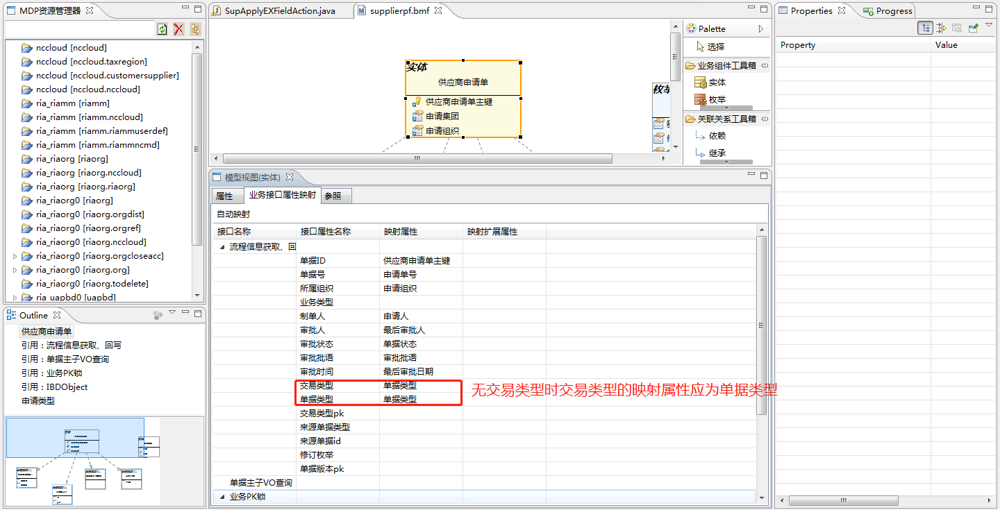
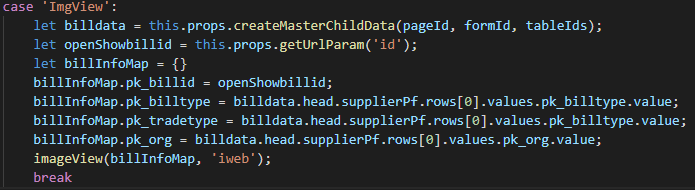
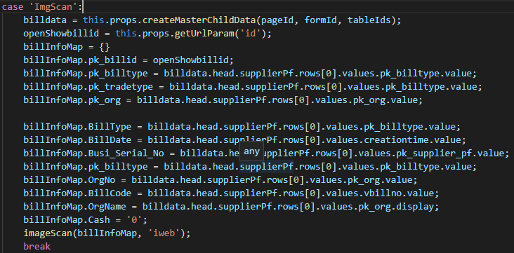

<menu>
{'parent':'4.节点开发实例',
'name':'4.工作流、审批流与影像扫描开发实例'}
</menu>

## 4.5 工作流、审批流与影像扫描开发实例
本小节以供应商申请单为例详述工作流、审批流以及影像的适配。下面分三个部分描述。
### 4.5.1 审批流
审批流的开发过程当中，如果要开发的节点不是原NC的节点或者原NC不存在审批流，那么就需要自己从头按照3.7.1小节的流程走一遍。
如果原NC已经存在审批流了，那么开发人员需要在NCC当中添加两个Acton类文件：分别负责提交和收回，注册一个审批应用，同时导入审批详情组件实现审批详情的展示。审批应用的注册参考3.7.1.4，审批详情组件的使用可参考3.7.1.4小节。
提交的Action可见类文件：
```
nccloud.web.uapbd.supplier.supplierapply.CommitSupplierAction
```
该类当中的
```
private Object processFlowVOs(ArrayList<AggSupplierPfVO> list， JSONObject content) throws BusinessException
```
方法实现了具体的提交操作。
收回的Action可参考类文件：
```
nccloud.web.uapbd.supplier.supplierapply.CallbackSupplierAction
```
审批应用注册即同普通应用注册类似。
审批详情的使用，需要导入ApproveDetail组件，可参考前端UAPBD工程：
```
/uapbd/supplier/supplierapply/card/index.js
```
### 4.5.2 工作流以及共享服务接入实例
工作流以及共享服务接入主要工作在于脚本的预置，同时还需要编码部分工作流需要的动作类。接入的具体细节可以参考3.7.2小节。

#### 4.5.2.1 脚本注册
脚本的注册可以参考供应商申请单的注册脚本，可以找一个NCC的环境，根据3.7.2.2小节当中的内容以及10GY的编码查询相关预置数据，相关表格如下：
```
sscrp_busiclass、sscrp_busiclass_b、sscrp_fieldmap，sscrp_fieldmap_b、pub_workflowgadget、pub_wf_participantex、org_sscbusiunitclientage、BD_SHAREBILLTYPE
```
脚本注册完成之后开发人员所在模块是否依赖共享决定将脚本交予共享模块维护还是自己模块维护。

#### 4.5.2.2 编码工作
本小节主要讲述适配共享服务需要做的编码工作。
我的报账门户类可以参考类文件
```
nccloud.web.uapbd.supplier.supplierapply.SupplierApplyPortal
```
实现其中的方法。该类文件主要是为了提供我的报账跳转到相关业务单据的URL链接。
提交Action的实现参考类文件：
```
nccloud.web.uapbd.supplier.supplierapply.CallbackSupplierAction
```
收回Action的实现参考类文件：
```
nccloud.web.uapbd.supplier.supplierapply.CommitSupplierAction
```
#### 4.5.2.3 元数据问题
工作流以及共享服务当中需要业务接口属性映射的部分字段，需要注意部分单据交易类型没有映射的问题。


#### 4.5.2.4 工作流配置
工作流的配置比较简单，可以参照3.7.2.4小节。


### 4.5.3 影像扫描适配
影像扫描比较简单，编码工作比较少，主要是影像服务器的搭建。

#### 4.5.3.1 脚本注册
向数据库当中插入若干原始记录并提取为预置脚本。脚本的制作可以以供应商申请单的10GY编码为例，从一个标准的环境当中查询供应商申请单的预置脚本。有以下几张表格：bd_scanbilltypeinfo，bd_scanconvertor，bd_imagescantype，bd_billtype2。

#### 4.5.3.2 代码适配
前端导入相关的方法然后调用即可实现影像扫描以及影像查看。代码如下：
1、影像查看代码适配：



2、影像扫描代码适配：



3、影像组件导入方式：
```
import {imageScan,  imageView} from "sscrp/rppub/components/image";
```
同时在单据的根目录下增加一个config.json文件，里面内容如下所示：
```
{
    "dependjs": ["../../../../sscrp/rppub/components/image/index.js"],
    "dependModuleName": ["sscrp/rppub/components/image"]
}
```
具体的内容可见前端UAPBD工程下文件
```
uapbd/supplier/supplierapply/card/index.js
```