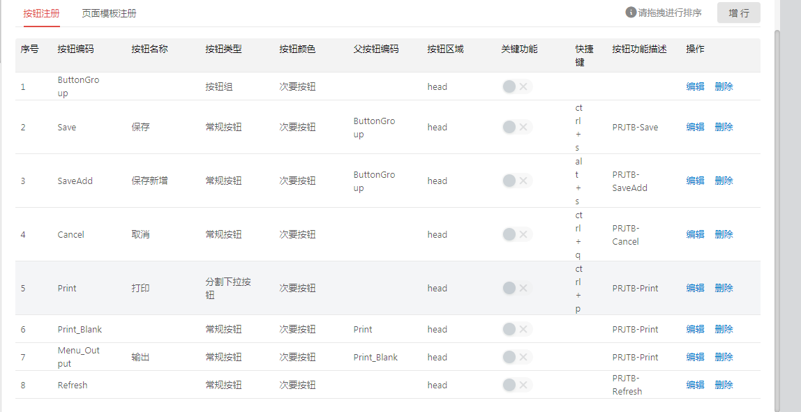
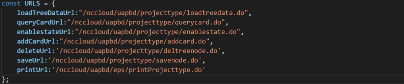
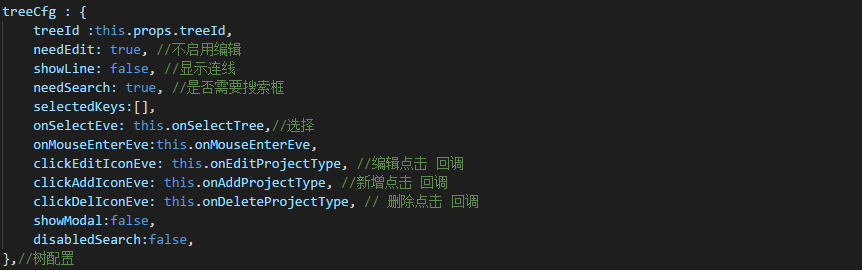

<menu>
{'parent':'4.节点开发实例',
'name':'4.3树卡节点开发实例'}
</menu>

## 4.3 树卡节点开发实例
　　开发前说明，以下树卡开发文档以项目类型节点为例，其他树卡节点与该节点类似。　　

### 4.3.1 开发前准备
#### 4.3.1.1 应用注册
##### 4.3.1.1.1　应用配置
　　登录系统，进入应用注册界面，如下图：  

uapbd的应用都在基础数据和组织管理目录下；登录NC系统，打开功能注册节点，如下图：  

找到项目类型节，如下图：  

一个全局节点一个集团节点，参照这里维护nccloud应用注册，如下图：  

应用下面挂有页面，有的节点有多个页面，有的节点只有一个页面，在应用配置中需要配置默认加载的页面，如下图：  

##### 4.3.1.1.2 页面配置
在应用下面新增应用页面，如下图：  

页面编码是：应用编码+”_”+form/card/list/grid/或其他；  
页面地址是：我们在前端工程中注册应用的绝对路径，/nccloud/resources/规定加在下图所示的路径前，如下图：  

#### 4.3.1.2 模板注册
　　在页面配置子表页签中可以添加节点对应的模板，树卡界面中只有卡片有模板，树组件没有模板，所以只需要添加卡片的模板即可，如下图：  

　　模板编码同页面编码；模板名称同页面名称；聚合类VO在后端工程中可以搜索到完整的类名，子表位置新增一条区域记录，自定义区域编码，区域名称，根据实际业务确定区域类型、设置类、关联元数据，如下图：  

　　设置完成后点击下一步，进行区域中的属性设置，一般情况下，只需要点击新增元数据按钮，把对应的元数据属性选择出来就可以，具体每个属性中的配置，可以参考详细的模板配置文档。完成后点击保存如下图：  

　　默认设置哪些属性显示，哪些属性不显示，我们可以参考NC端的单据模板初始化节点，如下图：  

#### 4.3.1.3 按钮注册
　　同样在页面配置子表页签中可以配置节点的按钮，参考NC节点上的按钮，在这里注册，如下图：  

按钮注册详细说明请参考按钮注册详细文档。  

#### 4.3.1.4 菜单注册
　　在nccloud系统中进入菜单注册节点，点击菜单项，进入菜单注册界面，如下图：  

在对应目录位置下注册项目类型节点的菜单，如下图：  

具体内容参考NC菜单注册节点，如下图：  

#### 4.3.1.5 多语注册
多语文件位置：uapbd/public/lang/standard/simpchn/你节点的编码.json。  
本节点定义多语文件名称为：10140PRJT.json，具体格式如下图：  

多语Key为：你节点的编码-六位数字；  
多语value为：要多语的汉语文字。  
注意：完成后执行 Alt+Shift+F 对文本进行格式化。  

### 4.3.2 树卡应用开发流程
#### 4.3.2.1 项目类型节点简介
项目类型节点在动态建模平台-基础数据-项目信息下，如下图：  

树卡界面都是上下结构分为 head区域和body区域。  
Head区域放置的是标题、业务单元参照、显示停用复选框、业务功能按钮等  
Body区域分为左右两部分，左侧是树组件，右侧是卡片组件  
只有存在业务单元节点，并且只有在业务单元节点Head区域有业务单元参照，如下图：  

NC端该节点如下图：  

　　项目类型节点只有全局节点和集团节点；该节点具有新增、修改、删除、显示停用、刷新、停启用、打印/输出等功能。  

#### 4.3.2.2 前端
##### 4.3.2.2.1 前端文件目录结构
　　通过上面功能注册和菜单注册，我们了解到该节点分为全局节点和集团节点，对应的前端页面结构如下图：  

　　前端工程编译时默认编译的是index为名称的js文件，所以文件名称最好以index命名。首先编写公共入口类，不管是全局节点还是集团节点，都进入公共入口类，根据全局入口和集团入口给出的参数判断渲染全局节点还是集团节点。  

##### 4.3.2.2.2 编写项目类型类
　　在编写之前，先引入react相关包，如下图：  

然后需要引入平台提供的组件包，如下图：  

NCCheckbox组件包含在base中，如下图：  

定义节点中所需要的url，如下图：  

定义项目类型类：  

##### 4.3.2.2.3 创建构造函数

afterInit作用：等待单据模板、多语文件、按钮加载完成后初始页面；  
方法loadTemplateAndLang：请求单据模板、多语文件和按钮；  
方法resetState：重置state；  
方法loadTreeData：加载完页面后加载树数据  
方法setTreeData：加载树数据  
以下是上述方法的截图：  

##### 4.3.2.2.4 渲染页面
在react生命周期函数render方法中绘制树卡界面，如下图：  

　　在前面提到afterInit是等待初始数据完成后渲染页面，这里得到体现；  
　　Div的样式类是平台提供的，树卡界面的样式都按照这个模式写；  
　　使用基础组件NCCheckbox创建显示停用组件；  
　　从this.props中解构出平台提供的对象：  
　　const {syncTree，form，button，DragWidthCom} = this.props;  
　　使用平台提供的createButtonApp创建Head区域的按钮；  
　　DragWidthCom组件中包含左右两个部分，左侧是树组件，右侧是卡片Form组件，从syncTree对象中解构出createSyncTree对象，从form对象中解构出createForm对象；使用平台提供的createSyncTree和createForm 创建左树和右卡；  
　　使用平台提供的PrintOutput创建打印组件。

##### 4.3.2.2.5 组件配置

　　本页面中各个组件的配置，放在了state中，之前resetState方法截图中，我们把state的部分关闭了，这里我们展开描述。  
　　A、显示停用组件  
　　在state中配置显示停用组件如下图：  

　　onChange事件：设置checked属性值之后，重新加载树数据  
　　B、按钮组件  
　　在state中配置按钮组件如下图：  

　　onButtonClick事件：按钮点击统一事件派发入口回调，如下图：  

　　鼠标点击刷新按钮时触发页面刷新，左侧树重新加载数据；右侧卡片清空数据，停启用开关置灰，如下图：  

　　在卡片编辑态点击保存按钮，触发保存事件，获得表单form数据，构造请求参数，然后执行验证公式校验，之后再进行保存业务，保存完成后恢复到浏览态，如下图：  

　　点击保存新增按钮触发保存和新增两个动作，保存调用上图的保存逻辑，保存后调用新增方法如下图：  

　　点击取消按钮触发取消动作，如下图：  

　　树组件  
　　在state中配置树组件如下图：  

　　onSelectEve事件：鼠标点击树节点回调，加载点击节点的卡片信息；如下图：  

　　onMouseEnterEve事件：鼠标进入树节点回调；如下图：  

　　clickEditIconEve事件：鼠标点击树节点编辑图标回调；如下图：  

　　clickAddIconEve事件：鼠标点击树节点新增图标回调；如下图：  

　　clickDelIconEve事件：鼠标点击树节点删除图标回调；如下图：  

　　卡片组件  
　　在state中配置卡片组件如下图：  

　　onAfterEvent事件：表单项编辑后回调；编辑后事件，主要是在停启用时触发单据的停用和启用，如下图：  

　　onBeforeEvent事件：表单项编辑前回调，编辑前事件调用检查是否可以停启用，如下图：  

　　打印组件  
　　在state中配置打印组件如下图：  

　　此外在state中还需配置status属性来记录页面的状态，以便控制按钮的状态，curSelectNode来记录当前选中的树节点，如下图：  

　　公共文件ProjectType类编写完成。  

##### 4.3.2.2.6 全局或集团文件配置
　　在全局或集团文件中引入上面定义的ProjectType类，如下图：  

　　然后在本类中构造初始参数，如下图：  

　　通过平台提供的createPage方法创建页面，createPage时传递两个参数，一个是billInfo，一个是initTemplate;billInfo的作用可以参考文档http://git.yonyou.com/nc-pub/Public_Document/blob/master/%E5%89%8D%E7%AB%AF/%E5%89%8D%E7%AB%AF%E6%A1%86%E6%9E%B6/%E7%BC%96%E8%BE%91%E5%85%B3%E8%81%94%E9%A1%B9%E5%92%8C%E5%85%AC%E5%BC%8F%E7%9A%84%E9%80%82%E9%85%8D%E8%AF%B4%E6%98%8E.md；  
因为业务需要initTemplate 传递了一个{}参数，我们把这个参数放到ProjectType类中去初始了。如下图：  

　　最后进行渲染页面，如下图：  

　　至此，前端类编写完成。

#### 4.3.2.3 后端
##### 4.3.2.3.1 action配置
　　我们在前端ProjectType中定义了一个全局变量URLS，里面定义了多个url。我们以前端loadTreeData中用到的loadTreeDataUrl进行展开描述。loadTreeDataUrl，如下：  

　　首先在后端项目模块下创建xml格式的配置文件，如下图：  

　　路径格式是: yyconfig/modules/uapbd/模块名/应用名/config/action;具体projecttype.xml的内容如下图：  

　　上图配置中name属性值对应的是loadTreeDataUrl的uapbd/projecttype/loadtreedata部分，clazz属性值对应的是该url对应的action全路径，action如下图：  

　　其他功能对应的action配置与该action类似，如下图：  

　　具体后端action功能实现可以参考项目类型具体的代码，具体后端功能实现，不再做详细的赘述，如下图：  

##### 4.3.2.3.2 自定义项配置
　　自定义项配置文件路径：yyconfig/modules/uapbd/模块名/应用名/config/userdef，文件内容如下图：  

　　配置中name属性为当前VO对应的元数据路径；prefix属性是该VO的自定义项编码是以什么字符开头的；processor属性对应的是自定义项进行过滤避免出现全局节点加载集团节点的自定义项问题。  

##### 4.3.2.3.3 鉴权文件配置
　　鉴权文件路径：yyconfig/modules/uapbd/模块名/应用名/config/authorize，文件内容如下图：  

　　鉴权文件的内容中appcode对应的是我们在应用注册中的项目类型的全局节点和集团节点的应用编码，如下图：  

　　Actions中的action值分别对应的是action配置文件中的name属性值，如下图：  

