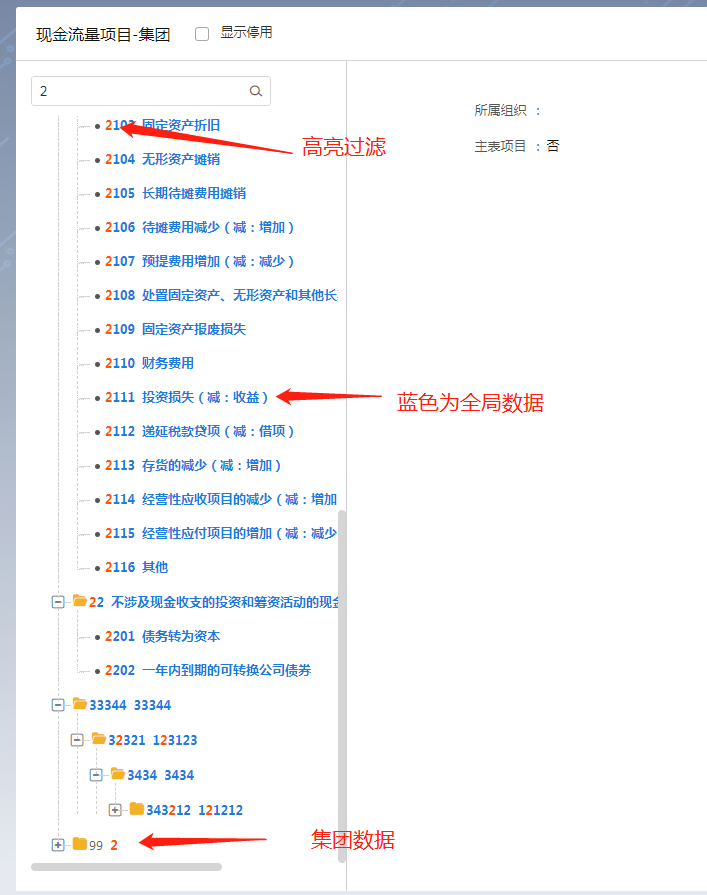
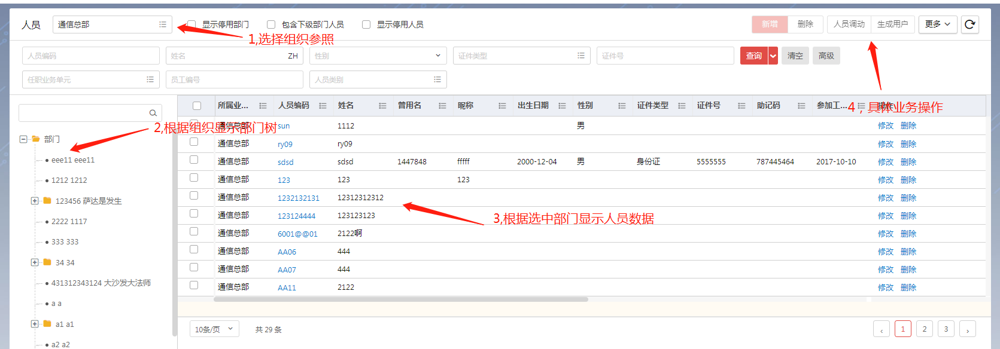
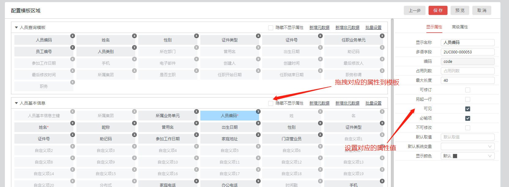

<menu>
{'parent':'4.节点开发实例',
'name':'4.6树表开发实例'}
</menu>

## 4.6 树表开发实例
### 4.6.1 开发前说明
特别说明：有特殊的或者具有平台不能满足的界面和功能，可用此方式开发。
有些特殊需求在高阶组件中不能支持需要降级使用基础组件来实现，如下图：

以下就用人员节点来演示下树表节点的开发，其中左树为NC基础组件，右表为高阶组件。
人员基本操作流程如下：

1、选中行政组织，选中后加载当前行政组织的部门
2、选中部门，加载当前部门的人员数据
3、勾选人员数据，点击按钮进行操作
用基础组件或基础组件混搭高阶组件，来实现复杂功能和个性化节点，见下面的列子。

### 4.6.2 开发前准备

#### 4.6.2.1 应用注册
##### 4.6.2.1.1应用配置
登录系统，进入应用注册界面，如下图：进行如下配置
1、添加应用，添加页面，添加按钮

##### 4.6.2.1.2前端
1、先创建了一个前端类，
2、编写构造方法，构造够构造方法中初始化单据模板，
注意：人员节点的构造函数内才会执行初始化单据模板，加载多语的操作。此没有使用平台提供的示例代码.此方式优点为：代码内聚性高， this指针明确，能够协调同异步出路，构造职责清晰。

其中createState方法，为当前的组件视图模型，MVVM模式以视图模型来驱动视图

平台提供的高阶组件没有提供MVVM模式，人员界面中，除了右表，其他为MVVM模式.所以没有对应的右表VM，
3、render方法，画出界面基本结构，

4、为组件添加监听事件处理业务即可.

在前端中，所有监听处理函数都以on开头，
在处理业务方法中，每个方法必须有明确的职责，并且职责单一(极为重要)，再通过组合方法，组成实际的业务处理。
明确的职责，并且职责单一，极为重要，直接会影响代码质量，扩展性，开发效率，和稳定性。

##### 4.6.2.1.3后端
后端处理方式以其他一致。可参考其他开发实例